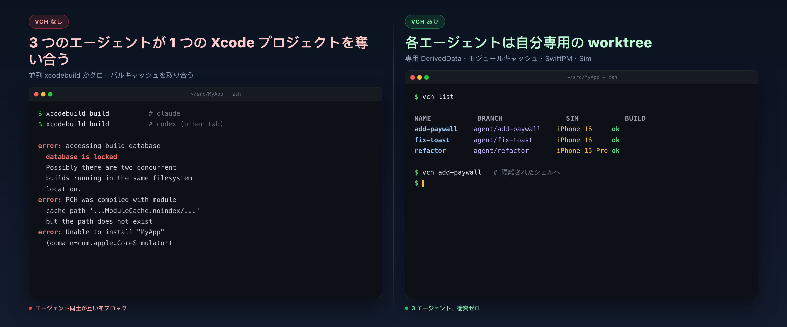
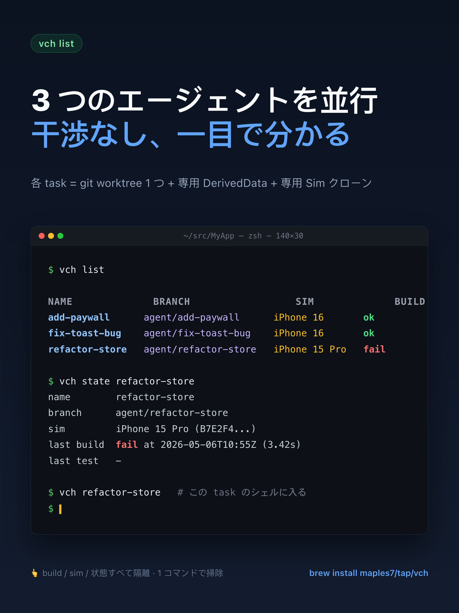
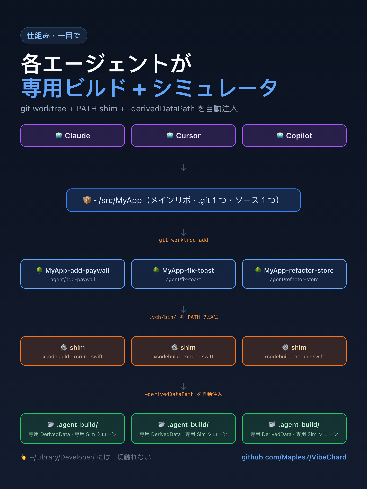

# VibeChard

[](https://github.com/Maples7/VibeChard/releases) [](https://github.com/Maples7/VibeChard/actions/workflows/ci.yml) [](LICENSE)  

[English](README.md) · [简体中文](README.zh-CN.md) · [繁體中文](README.zh-TW.md) · **日本語** · [한국어](README.ko.md)

<p align="center">
  <a href="docs/images/hero.ja.png"></a>
</p>

> **AI コーディングエージェント向け、Apple 開発のためのタスク単位で隔離された worktree。**
> 同じ Xcode プロジェクトに対して Claude / Codex / Copilot / Cursor を複数同時に走らせても、
> `build.db` のロック、`DerivedData` の取り合い、シミュレーターの衝突が起きません。

```sh
brew install maples7/tap/vch
```

<p align="center">
  
</p>

あとはどの Apple プロジェクトでも：

```sh
vch new add-paywall          # 隔離された worktree + agent ブランチを作成
vch add-paywall              # その worktree のシェルに入る（隔離が有効な状態）
                             # → いつもどおり xcodebuild / swift test を実行
vch test add-paywall --device "iPhone 16"
vch remove add-paywall
```

それだけです。各エージェントは専用の worktree、専用の `DerivedData`、専用のシミュレータークローンを持ちます——あなたの `~/Library/Developer/`
は 1 バイトも変更されません。

<p align="center">
  
</p>

> **ステータス: alpha (v0.2.0)。** CLI のインターフェースはほぼ落ち着いていますが
> まだ凍結されていません。`.vch/state.json` のスキーマには今後フィールドが
> 追加される可能性があります。安定が必要ならタグを固定してください。

## なぜ専用の CLI が必要なのか

汎用の git-worktree マネージャ（Rift、Emdash、Taskpods、Workie など）が解決するのは「ソースツリーの隔離」だけです。しかし Apple のツールチェインには
**他にも少なくとも 7 つ**の共有リソースがあり、`xcodebuild` を並列に走らせると互いに衝突して非決定的な失敗を引き起こします：

| リソース | 隔離しないとどうなるか | VibeChard の対応 |
|---|---|---|
| `DerivedData` | モジュール再ビルドの繰り返し、キャッシュ汚染 | `-derivedDataPath <wt>/.agent-build/DerivedData` |
| `ModuleCache.noindex` | 並行下で Clang モジュールキャッシュが破損 | worktree ごとに `CLANG_MODULE_CACHE_PATH` |
| SwiftPM グローバルキャッシュ | `Package.resolved` の書き込み競合 | worktree ごとに `-clonedSourcePackagesDirPath` |
| `xcresult` バンドル | 後勝ちで上書き | worktree ごとに `-resultBundlePath` |
| シミュレーターデバイス | 同じ iPhone 16 に 2 タスクが同時インストール | タスクごとに `xcrun simctl clone` |
| エージェントが PATH から `xcodebuild` を引く | 注入したフラグを素通り | **PATH シム**で自動的にフラグを注入 |
| ソースツリー | 標準的な対処 | `git worktree` + `agent/<name>` ブランチ |

**BYO Agent (Bring Your Own Agent)** です——Claude、Codex、Copilot、Cursor、シェルが叩けるものなら何でも。VibeChard は AI ベンダーのラッパーでは*ありません*。テレメトリなし、ネットワーク通信なし、SDK 依存なし。

<details>
<summary><strong>「<code>git worktree</code> と 5 行のシェル関数で十分じゃない？」</strong></summary>

<br/>

もっともな疑問です——最初は私もそうしました。ソースツリーは隠離できますが、エージェントが worktree 内で叩く `xcodebuild` は依然として以下の**グローバル**な場所を参照します：

- `~/Library/Developer/Xcode/DerivedData/MyApp-<hash>/`（グローバル既定値）
- `~/Library/Developer/Xcode/DerivedData/ModuleCache.noindex/`（グローバル）
- `~/Library/Caches/org.swift.swiftpm/`（グローバル）
- `~/Library/Developer/CoreSimulator/Devices/<UDID>/`（グローバル）

これらのいずれかが共有されている限り、並列の `xcodebuild` は競合します。解決策は二つ：

1. **毎回正しいフラグを渡す。** すべての `xcodebuild` と `swift test` で
   `-derivedDataPath` / `-clonedSourcePackagesDirPath` / `-resultBundlePath`
   を忘れずに。Tuist、Fastlane、各カスタムテストスクリプト、シェルアウトする `Package.swift` プラグインにも教え込む。そして *AI エージェント*にも忘れないよう念を押す——絶対に忘れます。
2. **`xcodebuild` の前に PATH シムを置く。** 誰がどんな方法で呼んでも、フラグが必ず効く状態にする。

VibeChard は (2) を採っています。これが「`.zshrc` のスニペット」ではなく CLI である唯一の理由です。

</details>

## インストール

### Homebrew（推奨）

```sh
brew install maples7/tap/vch
```

formula は以下をインストールします：

- `vch` を Homebrew の `bin/` に（`PATH` に載る）
- `vch-xcodebuild-shim` を `libexec/` に（**意図的に** `PATH` には載せない——タスクごとの `.vch/bin/` に `vch exec` が張るシンボリックリンク経由でのみ到達されるべきものです）
- Bash、Zsh、Fish の補完スクリプト

### ソースからビルド

要件: macOS 13+、Xcode 15.3+（Swift 5.10+）。

```sh
git clone https://github.com/maples7/VibeChard.git
cd VibeChard
swift build -c release
ln -s "$PWD/.build/release/vch" /usr/local/bin/vch    # CLI を置いている場所に合わせて
```

## クイックスタート

git 管理下の任意の Apple プロジェクト内で：

```sh
# 1. agent/add-paywall 上に隔離された worktree を起こす
vch new add-paywall

# 2. その中のシェルに入る（PATH シムが有効）
vch add-paywall
# このシェル内で：
#   xcodebuild build              ← -derivedDataPath が自動注入される
#   swift test                    ← モジュールキャッシュと SwiftPM の clone 先が隔離済み
#   exit                          ← 元のシェルに戻る

# 3. シェルに入らず直接 xcodebuild を呼ぶことも可能：
vch build add-paywall --scheme MyApp
vch test  add-paywall --scheme MyApp --device "iPhone 16"

# 4. worktree 内で直接エージェントを走らせる：
vch new fix-toast --exec "claude"     # 隔離された worktree 内で claude を起動
vch new triage --copy-untracked       # .env / .vscode など未追跡ファイルも一緒にコピー
vch exec fix-toast -- npm run lint    # worktree 内でワンショット実行

# 5. 確認とクリーンアップ
vch list
vch path add-paywall                  # worktree の絶対パス
vch remove add-paywall                # worktree + ブランチ + シミュレータークローンを削除
```

## ワークフロー：連続したタスク群

vch が本当に振るうのは、単発タスクではなく**互いに独立した短いタスクを連続**
（または並行）で回すケースです。各タスクはそれぞれの worktree で進め、取り込んで
から次に進みます。代表的なループ：

```sh
# 計画：A → B → C、それぞれをマージしてから次に進む。

# タスク A — 実装、テスト、レビュー。
vch new task-a
cd "$(vch path task-a)"
# ...編集...
vch build task-a --scheme MyApp
vch test  task-a --scheme MyApp --device "iPhone 16"
git commit -am "perf: task A"
vch open task-a                       # IDE でレビュー

# 承認されたらメイン worktree からマージ：
cd /path/to/main-worktree
git merge --no-ff agent/task-a -m "Merge agent/task-a: <subject>"
vch remove task-a                     # worktree + ブランチ + シミクローンをまとめて削除

# タスク B はクリーンな develop から同じサイクルを繰り返す。
vch new task-b
# ...
```

`vch new` のたびに SwiftPM 解決キャッシュ、DerivedData、モジュールキャッシュ
（いずれも `.vch/` 下）が独立で作られるため、並行中の 2 タスクが SPM ロック争いや
Xcode ビルドキャッシュの無効化で互いをブロックすることはありません。別のシェルで
複数の `vch test` を同時に走らせても Core Data ストアの衝突やシミュレーターの
上書きは起きません。

vch をスクリプトから驅動する場合（例：エージェントを回す）は、`.vch/state.json`
を手読みするより安定した `vch state <name> --field <dotted>` を使ってください：

```sh
udid=$(vch state task-a --field simulator.udid)
vch exec task-a -- xcodebuild test \
  -scheme MyApp \
  -destination "platform=iOS Simulator,id=$udid" \
  -only-testing:MyAppTests/Foo
```

## コマンド一覧

| コマンド | 役割 |
|---|---|
| `vch new <name>` | `../<repo>-<name>` に worktree を作成、ブランチは `agent/<name>`。`--exec "<cmd>"` で worktree 内で直接コマンド実行（例: AI エージェント）。`--copy-untracked` は未追跡かつ無視されていないファイル（`.env` / `.vscode/settings.json` など）もまとめてコピーします。 |
| `vch list` | 現在のワークスペース下のすべてのタスクを一覧。`--json` で機械可読出力。`-v`/`--verbose` で `BASE` と `PATH` 列を追加。 |
| `vch state <name>` | タスクの `.vch/state.json` を整形して表示。`--json` で生ファイル内容を出力。`--field <dotted>` で単一のスカラー値（例：`simulator.udid`）だけを出力——スクリプトで `$(vch state foo --field simulator.udid)` として使うため。 |
| `vch path <name>` | タスク worktree の絶対パスを出力。 |
| `vch open [<name>] [--with <ide>]` | worktree を IDE で開く。`*.xcworkspace` / `*.xcodeproj` / `Package.swift` を自動検出（プロジェクトファイルは Xcode、それ以外は VS Code）。`--with` は `xcode`、`code`/`vscode`、`cursor`、または任意のアプリ名（`open -a` に渡す）に対応。`VCH_OPEN_DEFAULT` でデフォルトを上書き可能。`<name>` 省略時は `$PWD` のある worktree を使う。 |
| `vch <name>` | `vch exec <name> -- $SHELL` のシュガー。隔離環境変数 + `.vch/bin` PATH シムが有効なシェルが立ち上がる。 |
| `vch exec <name> -- <cmd...>` | タスク worktree 内で任意のコマンドを実行（隔離有効）。 |
| `vch build <name> [flags] [-- xcodebuild-extras]` | タスクの worktree に対して `xcodebuild build` を実行。`-derivedDataPath` / `-clonedSourcePackagesDirPath` を自動注入。共有スキームが一つだけのプロジェクトでは `--scheme` を省略可能（`xcodebuild -list -json` で自動検出）。一度記録されたスキームは以降の呼び出しで再利用。`--runtime 'iOS 26.4'` は同名デバイステンプレートが複数 iOS ランタイムと共存する場合にランタイムをピン留めします。 |
| `vch test  <name> [flags] [-- xcodebuild-extras]` | `xcodebuild test` を実行し `-resultBundlePath` を注入。初回 `--device` 時にシミュレーターを遅延クローンし以降は再利用。スキームの自動検出と `--runtime` の振る舞いは `vch build` と同じ。デフォルトでは簡潔なサマリ（スイートごとに 1 行、失敗テストは file:line とアサーションメッセージとともに展開）のみを表示。`--verbose` で xcodebuild の出力をそのまま端末に流し込む。完全なログは常に `<wt>/.vch/last-test.log` に tee される。 |
| `vch run   <name> [flags] [-- launch-args]` | タスクに紐づいたシミュレータークローン上でアプリをビルド・インストール・起動。スキームの自動検出と `--runtime` の振る舞いは `vch build` と同じで、`PRODUCT_BUNDLE_IDENTIFIER` は `xcodebuild -showBuildSettings -json` から自動解決。`--` 以降の引数はそのまま `simctl launch` に転送されます（例：`vch run alpha -- -UsePreviewSampleData`）。必要に応じてクローンをブートし `Simulator.app` を開きます。 |
| `vch logs <name> [--test]` | タスク直近の `vch test` の xcodebuild フルログを表示。簡潔サマリが失敗を示したとき周辺ログを確認するのに便利。現状は `--test` のみ対応；ログは毎回上書きされる。 |
| `vch sim {clone,erase,shutdown,info} <name>` | タスクのシミュレータークローンを明示的に管理。 |
| `vch land <name> [--into <branch>] [--no-ff\|--ff-only\|--squash] [--message MSG] [--keep] [--allow-dirty] [--dry-run]` | `agent/<name>` をベースブランチ（`vch new` 時にメイン worktree がいたブランチ、`state.json` に記録済み）にマージして worktree を削除。デフォルトは `--no-ff`。デフォルトのコミットメッセージは `Merge agent/<name>: <最新の非マージコミットのサブジェクト>`。以下の場合マージを拒否：空マージ、メイン worktree がターゲットブランチと違う、メインの未コミットパスがタスクブランチの diff と重複（`--allow-dirty` で制御）。`--keep` で自動 rm をスキップ、`--dry-run` で計画を表示だけし何も変更しない。 |
| `vch remove <name> [--force [--force]] [--keep-sim]` | worktree、ブランチ、（デフォルトで）シミュレータークローンを削除。`--force` 2 回でダーティツリー＋未マージブランチも許容。 |
| `vch repair` | `git worktree list` の実状態に合わせて `.vch/state.json` を再同期。 |
| `vch doctor [--clean] [--json]` | 孤児シミュレータークローン、古いステートバインディング、破損 `state.json` を検出。検出時は非ゼロ終了。 |
| `vch shellenv` | `vch_cd` / `vch_new` / `vch_clean` のシェルヘルパーを出力（bash/zsh）。 |
| `vch completions install [--shell <s>]` | `zsh` / `bash` / `fish` の補完スクリプトをインストール（`$SHELL` から自動検出）。`--print` でプレビュー、`--force` で上書き。 |
| `vch version` | バージョンとツールチェイン情報を出力（`--json` で機械可読）。 |

`<name>` を取るすべてのコマンドはワークスペース内のタスクから補完されます——補完スクリプトを入れて `<TAB>` を押してください。

## 隔離の仕組み
<p align="center">
  
</p>
タスクの worktree 内では `<wt>/.vch/bin/` が `PATH` の先頭に挿入され、そこに `xcodebuild`、`xcrun`、`swift` のシンボリックリンクがあり、すべて
`vch-xcodebuild-shim` を指しています。

シムは 3 つの環境変数（`VCH_DERIVED_DATA_PATH`、`VCH_SPM_CLONE_DIR`、
`VCH_RESULT_BUNDLE_PATH`）を読み、ユーザーが明示的に渡していない場合は対応するフラグを `xcodebuild` の argv に注入し、ターゲットディレクトリを
`mkdir -p` で作成、その後 `/usr/bin/xcrun -f xcodebuild` で本物の
`xcodebuild` のパスを解決して `execv`（`PATH` を経由しないので自分自身を再帰呼び出しすることはありません）。`xcrun` と `swift` に対しては透過的にパススルーします。

結果：エージェントが起動しうるあらゆるツール——`xcodebuild`、`swift test`、
Tuist、内部で `xcodebuild` を呼び出すスクリプト——が自動的に隔離されます。フラグを手で渡す必要はありません。

`vch build`、`vch test`、`vch run` は PATH シムをスキップして直接 `xcodebuild` を同じフラグで呼び出します。呼び出し地点で引数がすべて分かっているためです。

## 設定

ありません。タスクごとの状態はすべて `<worktree>/.vch/state.json` に収まります。`~/.vchrc` も `.vch.toml` もグローバル設定ファイルもありません。唯一の実行時ノブは上記の `VCH_*` 環境変数です（通常は `vch exec` が自分でセットするので、手動で触る必要はほとんどありません）。

## VibeChard ではないもの

- **AI ベンダーのラッパーではありません。** SDK も API キーもモデル抽象もありません。好きなエージェントを使ってください——VibeChard は並列セッションを安全にすることだけを担当します。
- **クロスプラットフォームではありません。** 設計上 Apple 専用です。プロジェクトの価値は Xcode ツールチェインへの深さにあり、広さにはありません。
- **CI オーケストレータではありません。** ローカルのターミナルで、ディスク上の
  worktree に対して動作します。CI マトリクスは別の問題です。

## よくある質問

<details>
<summary><strong>Tuist / Fastlane / xcbeautify と組み合わせて使えますか？</strong></summary>

<br/>

使えます。PATH シムは誰が起動しても `xcodebuild` の呼び出しをすべてキャッチします。Tuist が生成する実行、Fastlane の `gym` / `scan`、
xcbeautify の上流パイプ、最終的に `xcodebuild` を叩くカスタムテストスクリプト — どれもタスクごとの `-derivedDataPath` /
`-clonedSourcePackagesDirPath` / `-resultBundlePath` が自動で注入されます。フラグの取り回しは不要です。

</details>

<details>
<summary><strong>CocoaPods / Carthage は？</strong></summary>

<br/>

問題ありません。依存解決のステップは `xcodebuild` を経由しないので隔離不要。ビルドステップは結局 `xcodebuild` を呼ぶのでシムがキャッチします。
`Pods/` と `Carthage/` ディレクトリはソースと同じ worktree 内にあるので、
`git worktree` 自体で隔離されます。

</details>

<details>
<summary><strong>SwiftPM のみのプロジェクト（<code>.xcodeproj</code> なし）？</strong></summary>

<br/>

動きます。`swift build` / `swift test` は既定で worktree ごとの `.build/`
ディレクトリに書き込むため、シムによるフラグ注入なしで初めから隔離されています。シムは透明な passthrough として `swift` をラップしますが argv は変更しません。

</details>

<details>
<summary><strong><code>vch remove</code> 時に未コミットの変更はどうなる？</strong></summary>

<br/>

失われません — `vch remove` は dirty な worktree では明確なメッセージとともに中断します。`--force` を 1 回付けると上書きで削除（未コミット変更を失います）、2 回付けると未マージのコミットを持つブランチも削除できます。無言で破壊的に動くパスはありません。

</details>

<details>
<summary><strong>AI エージェントなしでも使えますか？</strong></summary>

<br/>

はい。「並列のサンドボックスが欲しい」シナリオすべてに使えます：同じ機能の別実装を 2 つ並走させる、長い test suite を走らせている裏でメイン worktree
でコーディングを続ける、など。CLI はエージェントに依存しません —いわゆる「エージェント連携」は `--exec "<your command>"` だけです。

</details>

## ソースからビルド・テスト

```sh
swift build -c release
./.build/release/vch version
swift test --parallel             # 284 テスト、M シリーズで約 41 秒
```

CI は push のたびに同じコマンド + シムのスモークテストを実行します：
[.github/workflows/ci.yml](.github/workflows/ci.yml)。

## ライセンス

[Apache-2.0](LICENSE)。CLA なし、テレメトリなし、ネットワーク通信なし。
