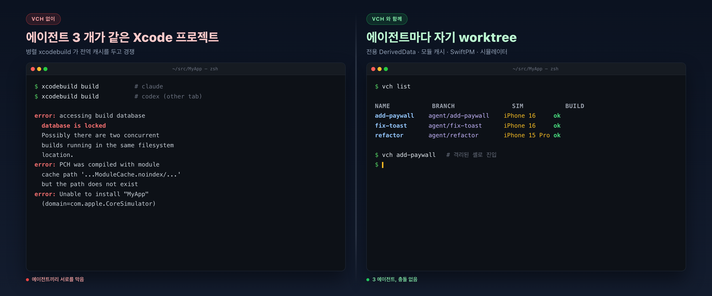
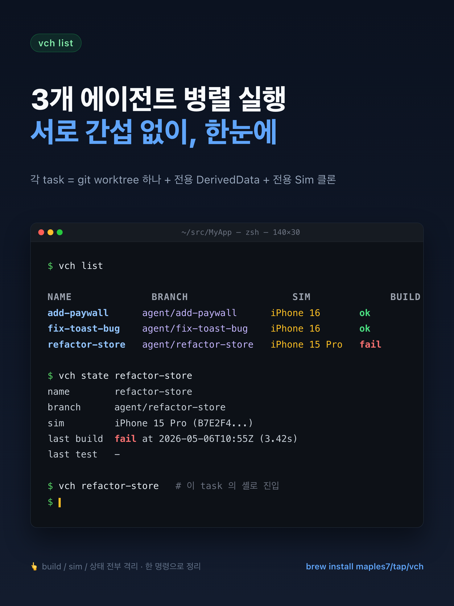
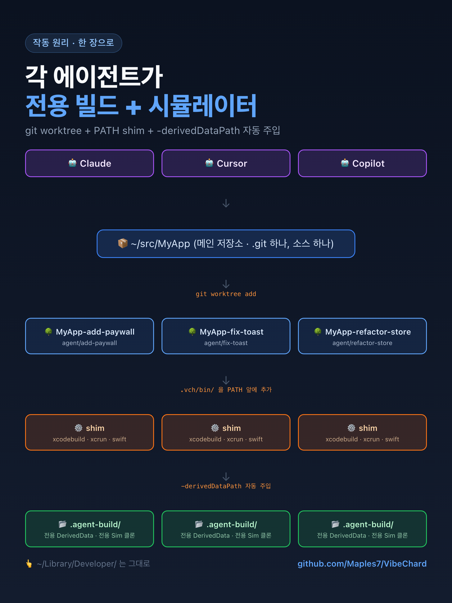

# VibeChard

[](https://github.com/Maples7/VibeChard/releases) [](https://github.com/Maples7/VibeChard/actions/workflows/ci.yml) [](LICENSE) [](https://swiftpackageindex.com/Maples7/VibeChard) [](https://swiftpackageindex.com/Maples7/VibeChard)

[English](README.md) · [简体中文](README.zh-CN.md) · [繁體中文](README.zh-TW.md) · [日本語](README.ja.md) · **한국어**

<p align="center">
  <a href="docs/images/hero.ko.png"></a>
</p>

> **AI 코딩 에이전트와 함께하는 Apple 병렬 개발을 위한, 작업 단위로 격리된 worktree.**
> 동일한 Xcode 프로젝트에서 Claude / Codex / Copilot / Cursor 세션을 동시에 여러 개
> 실행해도 `build.db` 잠금, `DerivedData` 충돌, 시뮬레이터 충돌이 발생하지 않습니다.

```sh
brew install maples7/tap/vch
```

<p align="center">
  
</p>

그다음 어떤 Apple 프로젝트에서든:

```sh
vch new add-paywall          # 격리된 worktree + agent 브랜치 생성
vch add-paywall              # 격리가 적용된 셸로 진입
                             # → 평소처럼 xcodebuild / swift test 실행
vch test add-paywall --device "iPhone 16"
vch remove add-paywall
```

이게 전부입니다. 각 에이전트는 자신만의 worktree, 자신만의 `DerivedData`,
자신만의 시뮬레이터 클론을 가지며 — 사용자의 `~/Library/Developer/`는
1 바이트도 건드리지 않습니다.

<p align="center">
  
</p>

> **상태: alpha.** CLI 표면은 거의 안정화되었지만 아직 동결되지
> 않았습니다. `.vch/state.json` 스키마에는 이후 필드가 추가될 수 있습니다.
> 안정성이 필요하면 태그를 고정하세요.

## 왜 별도의 CLI 가 필요한가

범용 git-worktree 매니저(Rift, Emdash, Taskpods, Workie 등)는 "소스 트리 격리"하나만 해결합니다. 그러나 Apple 툴체인에는 병렬 `xcodebuild` 실행 시 서로충돌하여 비결정적 실패를 일으키는 공유 자원이 **최소 7 개 더** 있습니다:

| 자원 | 격리하지 않을 때의 문제 | VibeChard 의 해법 |
|---|---|---|
| `DerivedData` | 모듈 재빌드 반복, 캐시 오염 | `-derivedDataPath <wt>/.agent-build/DerivedData` |
| `ModuleCache.noindex` | 동시성 하에서 Clang 모듈 캐시 손상 | worktree 별 `CLANG_MODULE_CACHE_PATH` |
| SwiftPM 전역 캐시 | `Package.resolved` 쓰기 충돌 | worktree 별 `-clonedSourcePackagesDirPath` |
| `xcresult` 번들 | 나중에 쓴 쪽이 덮어씀 | worktree 별 `-resultBundlePath` |
| 시뮬레이터 디바이스 | 같은 iPhone 16 에 두 작업이 동시에 설치 | 작업별 `xcrun simctl clone` |
| 에이전트가 PATH 로 `xcodebuild` 검색 | 주입한 플래그를 우회 | **PATH shim** 으로 자동 주입 |
| 소스 트리 | 표준 처리 | `git worktree` + `agent/<name>` 브랜치 |

**BYO Agent (Bring Your Own Agent)** 입니다 — Claude, Codex, Copilot, Cursor 등셸을 호출할 수 있는 무엇이든 됩니다. VibeChard 는 AI 벤더 래퍼가 *아닙니다*.
텔레메트리 없음, 네트워크 호출 없음, SDK 종속 없음.
<details>
<summary><strong>"<code>git worktree</code> 에 셰 함수 5 줄 감싸면 되지 않나?"</strong></summary>

<br/>

합리적인 의심입니다 — 저도 처음엔 그렇게 했습니다. 소스 트리는 격리되지만,
에이전트가 worktree 안에서 호출하는 `xcodebuild` 는 여전히 다음의
**전역** 위치들을 참조합니다:

- `~/Library/Developer/Xcode/DerivedData/MyApp-<hash>/` (전역 기본값)
- `~/Library/Developer/Xcode/DerivedData/ModuleCache.noindex/` (전역)
- `~/Library/Caches/org.swift.swiftpm/` (전역)
- `~/Library/Developer/CoreSimulator/Devices/<UDID>/` (전역)

이 중 하나라도 공유되는 한 병렬 `xcodebuild` 는 경쟁 조건에 빠집니다.
해결책은 두 가지:

1. **매번 올바른 플래그를 직접 넘기기.** 모든 `xcodebuild` 와 `swift test` 에
   `-derivedDataPath` / `-clonedSourcePackagesDirPath` / `-resultBundlePath`
   를 빼먹지 말고. Tuist, Fastlane, 모든 커스텀 테스트 스크립트,
   셰아웃하는 `Package.swift` 플러그인에도 다 적용. 그리고 *AI 에이전트*에게도 잊지 말라고 — 반드시 잊습니다.
2. **`xcodebuild` 앞에 PATH shim 을 둔다.** 누가 어떻게 호출하든 플래그가항상 적용되도록.

VibeChard 는 (2) 를 선택했습니다. 이것이 `.zshrc` 스니펫이 아닌 CLI 인유일한 이유입니다.

</details>
## 설치

### Homebrew (권장)

```sh
brew install maples7/tap/vch
```

formula 가 설치하는 항목:

- `vch` 를 Homebrew 의 `bin/` 에 (`PATH` 에 포함)
- `vch-xcodebuild-shim` 을 `libexec/` 에 (**의도적으로** `PATH` 에 두지 않음— 작업별 `.vch/bin/` 안에 `vch exec` 가 만든 심볼릭 링크를 통해서만도달해야 합니다)
- Bash, Zsh, Fish 자동완성 스크립트

### 소스로부터 빌드

요구 사항: macOS 13+, Xcode 15.3+ (Swift 5.10+).

```sh
git clone https://github.com/maples7/VibeChard.git
cd VibeChard
swift build -c release
ln -s "$PWD/.build/release/vch" /usr/local/bin/vch    # CLI 보관 경로에 맞춰
```

## 빠른 시작

git 으로 관리되는 임의의 Apple 프로젝트 안에서:

```sh
# 1. agent/add-paywall 위에 격리된 worktree 생성
vch new add-paywall

# 2. 그 안의 셸로 진입 (PATH shim 활성)
vch add-paywall
# 이 셸 안에서:
#   xcodebuild build              ← -derivedDataPath 가 자동 주입됨
#   swift test                    ← 모듈 캐시 + SwiftPM 클론 디렉터리 격리됨
#   exit                          ← 원래 셸로 복귀

# 3. 셸에 들어가지 않고 바로 xcodebuild 호출도 가능:
vch build add-paywall --scheme MyApp
vch test  add-paywall --scheme MyApp --device "iPhone 16"

# 4. worktree 안에서 직접 에이전트 구동:
vch new fix-toast --exec "claude"     # 격리된 worktree 에서 claude 실행
vch new triage --copy-untracked       # .env / .vscode 등 추적되지 않은 파일도 함께 복사
vch new codex-fix --adopt-current     # agent 가 이미 만든 linked worktree 를 현재 위치에서 채택
vch exec fix-toast -- npm run lint    # worktree 안에서 일회성 명령 실행

# 5. 점검과 정리
vch list
vch path add-paywall                  # worktree 의 절대 경로
vch remove add-paywall                # worktree + 브랜치 + 시뮬레이터 클론 삭제
```

## 워크플로우: 일련의 작업들

vch 가 제일 빛을 발하는 장면은 단일 작업이 아니라 **서로 고립된 짧은 작업들을
연속**(또는 몇 개를 병렬)해서 돌리는 경우입니다. 각 작업은 자신만의 worktree 에서
진행되고, 대상에 포함된 후에야 다음 작업이 시작됩니다. 전형적인 루프:

```sh
# 계획: A → B → C, 각각을 머지한 다음 다음으로 넘어감.

# 작업 A — 구현, 테스트, 리뷰.
vch new task-a
cd "$(vch path task-a)"
# ...편집...
vch build task-a --scheme MyApp
vch test  task-a --scheme MyApp --device "iPhone 16"
git commit -am "perf: task A"
vch open task-a                       # IDE 에서 리뷰

# 승인되면 메인 worktree 에서 마쟀:
cd /path/to/main-worktree
git merge --no-ff agent/task-a -m "Merge agent/task-a: <subject>"
vch remove task-a                     # worktree + 브랜치 + 시뮬클론 한 번에 정리

# 작업 B 는 깨끗한 develop 에서 동일한 사이클 반복.
vch new task-b
# ...
```

`vch new` 할 때마다 SwiftPM 해소 캡시, DerivedData, 모듈 캡시(모두 `.vch/`
아래)가 독립적으로 생성되므로, 병렬로 진행 중인 두 작업이 SPM 락 경쟁이나
Xcode 빌드 캡시 무효화로 서로를 막는 일이 없습니다. 서로 다른 셰에서 여러
`vch test` 를 동시에 돌려도 Core Data 스토어 충돌이나 시뮬레이터 뎍어쓰기가
일어나지 않습니다.

build/test 루프를 스크립트로 돌릴 때는 raw
`vch exec ... xcodebuild ...` 보다 `vch build` / `vch test` 를 우선하세요.
상위 명령은 간결한 요약, 로그, result bundle 경로를 함께 관리합니다:

```sh
vch test task-a --scheme MyApp --device 'iPhone 16' \
  --only-testing MyAppTests/Foo
```

저수준 도구를 직접 호출해야 할 때도 `.vch/state.json` 을 직접 읽는 대신
안정적인 `vch state <name> --field <dotted>` 접근자를 쓰세요.

## Cookbook

내장 명령어는 아니지만 자주 묻는 사용 패턴들 —— WIP 중인 작업에서 분기,
테스트 일부만 실행, 장기 작업을 최신으로 유지, `vch land` 시 생성물 보존,
warm 시뮬레이터 템플릿으로 첫 부팅 건너뛰기, 작업별 시뮬레이터 상태 초기
화, 템플릿이 Booted 상태에 갇혔을 때 처리, 이미 머지된 작업 일괄 정리 등.

→ 자세한 내용은 **[docs/cookbook.md](docs/cookbook.md)** 참조 (영문 단일
원본; [AGENTS.md 규칙 #10](AGENTS.md) 참조).

## 명령어

| 명령어 | 하는 일 |
|---|---|
| `vch new <name>` | worktree 와 `agent/<name>` 브랜치 생성 (`--exec "<cmd>"`, `--copy-untracked`, `--seed-spm-from <task>`, `--adopt-current`, `--cd`). |
| `vch list` | 워크스페이스의 모든 작업을 나열 (`--json`, `-v`, `--git-status`). |
| `vch state <name>` | 작업의 `.vch/state.json` 출력 (`--json`, `--field <dotted>`). |
| `vch path <name>` | 작업 worktree 의 절대 경로 출력. |
| `vch open [<name>]` | worktree 를 IDE 로 열기 (`--with xcode`/`code`/`cursor`/…). |
| `vch <name>` | worktree 셸로 진입 — 격리 환경과 PATH shim 활성. |
| `vch exec <name> -- <cmd...>` | 작업 worktree 내부에서 임의 명령 실행 (격리 활성). |
| `vch build <name>` | `xcodebuild build` 실행 시 `-derivedDataPath` / `-clonedSourcePackagesDirPath` 자동 주입 (`--scheme`, `--runtime`, `--erase-clone`, `--shutdown-template`, `--verbose`). |
| `vch test <name>` | `xcodebuild test` 실행 시 `-resultBundlePath` 주입; 시뮬레이터는 지연 클론 (`--device`, `--runtime`, `--only-testing`, `--skip-testing`, `--rerun`, `--rerun-failed`, `--erase-clone`, `--shutdown-template`). |
| `vch run <name>` | 작업의 시뮬레이터 클론 위에서 빌드·설치·실행 (`--erase-clone`, `--shutdown-template`, `-- launch-args`). |
| `vch logs <name>` | 작업 가장 최근 빌드/테스트의 전체 xcodebuild 로그 출력 (`--test`/`--build`). |
| `vch sim {clone,erase,shutdown,info} <name>` | 작업별 시뮬레이터 클론을 명시적으로 관리. |
| `vch sim warm-template {create,list,remove}` | 공유 *warm* 시뮬레이터 템플릿 관리 (iOS / watchOS / tvOS / visionOS, [#47](https://github.com/Maples7/VibeChard/issues/47) / [#58](https://github.com/Maples7/VibeChard/issues/58)). |
| `vch land <name>` | `agent/<name>` 를 base 에 머지하고 정리 (`--into`, `--no-ff`/`--ff-only`/`--squash`, `--keep`, `--push`/`--push-to`, `--dry-run`). |
| `vch sync <name>` | base 의 upstream 을 fetch 하고 작업 브랜치를 rebase (`--onto`, `--merge`, `--no-fetch`, `--dry-run`). |
| `vch remove <name>` | vch 가 만든 worktree, 브랜치, 시뮬레이터 클론을 삭제; 채택한 작업은 vch 상태만 해제 (`--allow-dirty`, `--force`, `--allow-unmerged`, `--keep-sim`). |
| `vch prune` | base 에 완전히 머지된 작업을 나열/삭제 (`--rm`, `--allow-dirty`, `--force`, `--keep-sim`, `--json`). |
| `vch repair` | `git worktree list` 실제 상태와 `.vch/state.json` 재동기화. |
| `vch clean <name>` | 작업의 DerivedData / ModuleCache 삭제 (`--swiftpm`, `--logs`, `--all`, `--dry-run`). |
| `vch doctor` | 고아 시뮬레이터 클론, 깨진 바인딩, 손상된 `state.json` 검출 (`--clean`, `--bug-report`, `--json`). |
| `vch shellenv` | `vch_cd` / `vch_new` / `vch_clean` 셸 헬퍼 출력 (bash/zsh). |
| `vch completions install` | `zsh` / `bash` / `fish` 자동완성 설치 (`--shell`, `--print`, `--force`). |
| `vch version` | 버전과 툴체인 정보 출력 (`--json` 은 머신 리더블). |

`<name>` 을 받는 모든 명령어는 현재 워크스페이스의 작업 이름으로 자동완성
됩니다 —— 자동완성 스크립트를 설치하고 `<TAB>` 만 누르면 됩니다. 전체 flag
레퍼런스는 **[docs/commands.md](docs/commands.md)** 참조.

## 격리 동작 원리

<p align="center">
  
</p>

작업 worktree 안에서 `<wt>/.vch/bin/` 이 `PATH` 의 맨 앞에 추가되며,
이 디렉터리에는 `xcodebuild`, `xcrun`, `swift` 세 개의 심볼릭 링크가모두 `vch-xcodebuild-shim` 을 가리킵니다.

shim 은 세 개의 환경 변수(`VCH_DERIVED_DATA_PATH`, `VCH_SPM_CLONE_DIR`,
`VCH_RESULT_BUNDLE_PATH`)를 읽고, 사용자가 해당 플래그를 명시적으로 전달하지않은 경우 `xcodebuild` 의 argv 에 주입한 뒤, 대상 디렉터리를 `mkdir -p` 로만들고, `/usr/bin/xcrun -f xcodebuild` 로 실제 `xcodebuild` 경로를 해결하여
`execv` 로 실행합니다(자기 자신을 재귀 호출하지 않도록 `PATH` 를 우회).
`xcrun` 과 `swift` 에 대해서는 투명한 패스스루입니다.

결과: 에이전트가 실행할 수 있는 모든 도구 — `xcodebuild`, `swift test`,
Tuist, 내부에서 `xcodebuild` 를 호출하는 스크립트 — 가 자동으로 격리됩니다.
플래그를 손으로 전달할 필요가 없습니다.

`vch build`, `vch test`, `vch run` 은 호출 시점에 인자를 모두 알고 있으므로 PATH shim 을 거치지 않고 같은 플래그로 `xcodebuild` 를 직접 호출합니다.

### `vch exec` / `vch <name>` 가 자식 프로세스에 주입하는 것

`vch <name>`(= `vch exec <name> -- $SHELL`) 와 `vch exec <name> --
<cmd>` 는 사용자의 환경 위에 결정적인 env 한 겹을 얹습니다. 이는
`vch build` / `vch test` / `vch run` 이 사용하는 것과 정확히 같은
집합이라, `vch <name>` 안에서 직접 `xcodebuild` 를 호출해도 `vch
build` 와 동일하게 동작합니다. "작업 환경에 들어가기" 전용의 별도
명령은 거의 필요 없습니다 — `vch <name>` 가 이미 그 역할을 합니다:

| 변수 | 값 |
|---|---|
| `VCH_TASK_NAME` | 작업 이름(예: `add-paywall`). PS1 / 터미널 타이틀에 유용. |
| `VCH_TASK_ROOT` | worktree 절대 경로. |
| `VCH_DERIVED_DATA_PATH` | `<wt>/.agent-build/DerivedData` (shim 이 읽음). |
| `VCH_SPM_CLONE_DIR` | `<wt>/.agent-build/SourcePackages` (shim 이 읽음). |
| `VCH_RESULT_BUNDLE_PATH` | `<wt>/.agent-build/Result.xcresult` (shim 이 읽음). |
| `VCH_RESULT_BUNDLE_DIR` | result bundle 의 부모 디렉터리. |
| `CLANG_MODULE_CACHE_PATH` | `<wt>/.agent-build/ModuleCache` (clang 이 읽음). |
| `SWIFTPM_CACHE_DIR` | `<wt>/.agent-build/SourcePackages` (SwiftPM 이 읽음). |
| `DEVELOPER_DIR` | `xcode-select -p` 로 해석된 호스트의 선택 Xcode — 사용자가 이미 export 하지 않은 경우에만 주입. |
| `SIMCTL_CHILD_SIMULATOR_UDID` | 작업에 묶인 시뮬레이터 클론 — 클론이 묶여 있을 때만 설정. |
| `PATH` | `<wt>/.vch/bin` 을 맨 앞에 추가해 `xcodebuild` / `xcrun` / `swift` 가 shim 을 거치도록. |

`vch` 는 사용자가 이미 export 한 값을 덮어쓰지 않습니다 — `vch exec`
이전에 직접 export 한 값이 항상 우선합니다.

## 설정

없습니다. 작업별 상태는 모두 `<worktree>/.vch/state.json` 에 저장됩니다.
`~/.vchrc` 도, `.vch.toml` 도, 어떤 전역 설정 파일도 없습니다. 유일한런타임 노브는 위에서 언급한 `VCH_*` 환경 변수뿐입니다(보통 `vch exec` 가직접 설정하므로 손으로 만질 일은 거의 없습니다). `vch build`/`vch test`/`vch run` 은 호스트에서 선택된 `DEVELOPER_DIR`(`xcode-select -p` 로 해석)을 자식 프로세스에 전파합니다 — 직접 환경 변수를 설정하면 덮어쓸 수 있습니다.

`vch new` 가 `eval "$(vch shellenv)"` 힌트를 출력했다면 `VCH_NEW_HINT=0` 으로 끌 수 있습니다(또는 shell helper 를 설치해도 사라집니다).

## VibeChard 가 아닌 것

- **AI 벤더 래퍼가 아닙니다.** SDK 도, API 키도, 모델 추상화도 없습니다.
  원하는 어떤 에이전트든 사용하세요 — VibeChard 는 병렬 세션을 안전하게만드는 일만 합니다.
- **크로스 플랫폼이 아닙니다.** 설계상 Apple 전용입니다. 프로젝트의 가치는
  Xcode 툴체인에 대한 깊이에 있지 폭에 있지 않습니다.
- **CI 오케스트레이터가 아닙니다.** 로컬 터미널에서 디스크상의 worktree 에대해 동작합니다. CI 매트릭스는 다른 문제입니다.

## 자주 묻는 질문

<details>
<summary><strong>Tuist / Fastlane / xcbeautify 와 함께 쓸 수 있나요?</strong></summary>

<br/>

쓸 수 있습니다. PATH shim 은 누가 호출하든 모든 `xcodebuild` 호출을잡아냅니다. Tuist 가 생성하는 실행, Fastlane 의 `gym` / `scan`,
xcbeautify 의 상류 파이프, 결국 `xcodebuild` 로 떨어지는 커스텀 테스트스크립트 — 어떤 것이든 작업별 `-derivedDataPath` /
`-clonedSourcePackagesDirPath` / `-resultBundlePath` 가 자동 주입됩니다.
플래그를 직접 넘길 필요 없습니다.

</details>

<details>
<summary><strong>CocoaPods / Carthage 는요?</strong></summary>

<br/>

됩니다. 의존성 해결 단계는 `xcodebuild` 를 거치지 않아 격리할 게없고, 빌드 단계는 결국 `xcodebuild` 를 호출하므로 shim 이 잡습니다.
`Pods/` 와 `Carthage/` 디렉터리는 소스와 함께 worktree 안에 있으므로
`git worktree` 자체로 격리됩니다.

</details>

<details>
<summary><strong>SwiftPM 전용 프로젝트 (<code>.xcodeproj</code> 없음)?</strong></summary>

<br/>

작동합니다. `swift build` / `swift test` 는 기본적으로 worktree 별
`.build/` 디렉터리에 쓰므로 shim 의 플래그 주입 없이도 이미 격리됩니다.
shim 은 투명한 passthrough 로 `swift` 를 감싸지만 argv 는 수정하지않습니다.

</details>

<details>
<summary><strong><code>vch remove</code> 할 때 커밋되지 않은 변경은 어떻게 되나요?</strong></summary>

<br/>

날아가지 않습니다 — 거부합니다. `vch remove` 는 dirty 한 worktree 에서명확한 메시지와 함께 중단합니다. `--allow-dirty` 를 넘기면 강제 삭제 (미커밋변경 손실), `--allow-unmerged` 를 넘기면 (또는 둘을 함께 사용) 미머지 커밋이 있는 브랜치 삭제까지 허용합니다.
조용히 파괴적인 경로는 없습니다.

</details>

<details>
<summary><strong>AI 에이전트 없이도 쓸 수 있나요?</strong></summary>

<br/>

네. "병렬 샌드박스가 필요한" 모든 시나리오에 적용됩니다: 같은 기능의 두가지 구현을 동시에 시도, 긴 테스트 스위트를 돌리는 동안 메인 worktree
에서 코딩 계속 등. CLI 는 에이전트 비종속입니다 — 이른바 "에이전트 통합"은 `--exec "<your command>"` 일 뿐입니다.

</details>

## 소스로 빌드 및 테스트

```sh
swift build -c release
./.build/release/vch version
swift test --parallel
```

CI 는 push 마다 같은 명령과 shim 스모크 프로브를 실행합니다:
[.github/workflows/ci.yml](.github/workflows/ci.yml).

## 라이선스

[Apache-2.0](LICENSE). CLA 없음, 텔레메트리 없음, 네트워크 호출 없음.
