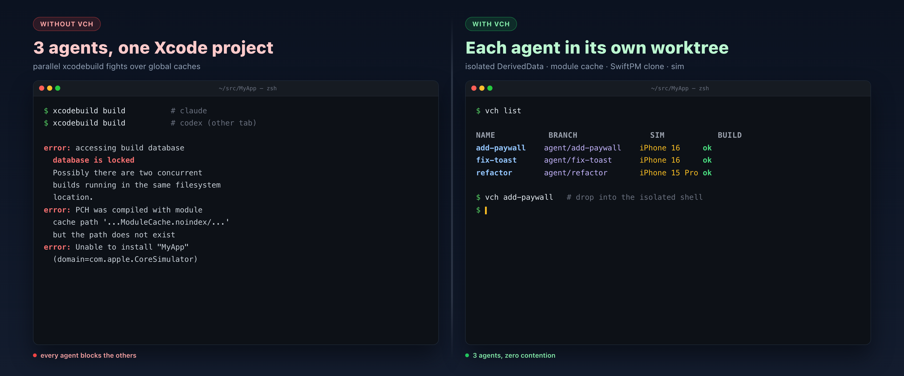
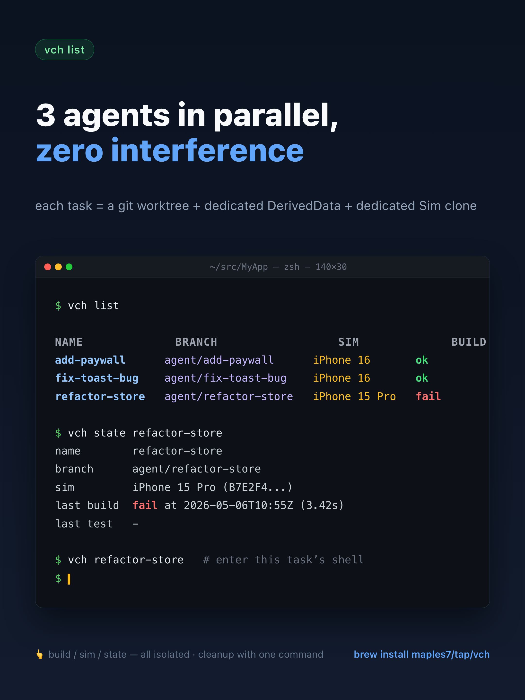
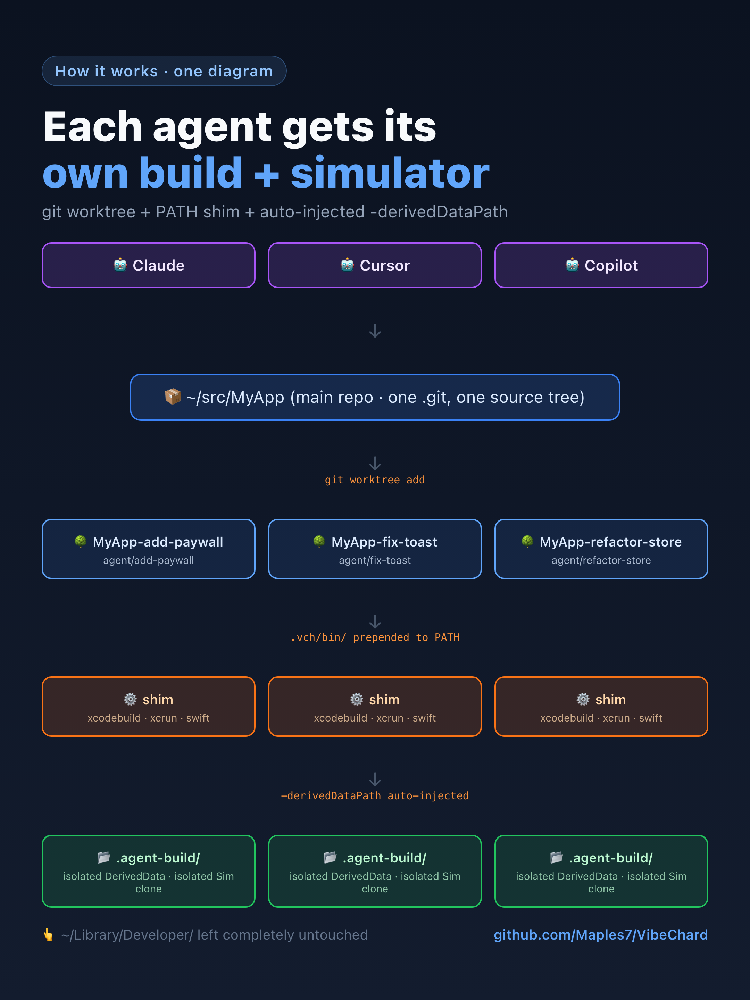

# VibeChard

[](https://github.com/Maples7/VibeChard/releases) [](https://github.com/Maples7/VibeChard/actions/workflows/ci.yml) [](LICENSE)  

**English** · [简体中文](README.zh-CN.md) · [繁體中文](README.zh-TW.md) · [日本語](README.ja.md) · [한국어](README.ko.md)

<p align="center">
  <a href="docs/images/hero.en.png"></a>
</p>

> **Per-task isolated worktrees for parallel Apple development with AI agents.**
> Run multiple Claude / Codex / Copilot / Cursor sessions on the same Xcode
> project without `build.db` locks, `DerivedData` thrash, or simulator
> collisions.

```sh
brew install maples7/tap/vch
```

<p align="center">
  
</p>

Then, in any Apple project:

```sh
vch new add-paywall          # creates an isolated worktree + agent branch
vch add-paywall              # drops you into a shell with isolation active
                             # → run xcodebuild / swift test as usual
vch test add-paywall --device "iPhone 16"
vch remove add-paywall
```

That's it. Every agent gets its own worktree, its own `DerivedData`, its
own simulator clone — and your `~/Library/Developer/` stays untouched.

<p align="center">
  
</p>

> **Status: alpha.** The CLI surface is settling but not yet
> frozen; on-disk `.vch/state.json` may gain fields. Pin a tag if you
> need stability.

## Why a CLI just for this?

Generic git-worktree managers stop at "isolate the source tree." Apple's
toolchain has at least seven *more* shared resources that, when contended
by parallel `xcodebuild` runs, cause non-deterministic failures:

| Resource | What goes wrong | VibeChard's answer |
|---|---|---|
| `DerivedData` | Module rebuild thrash, stale caches | `-derivedDataPath <wt>/.agent-build/DerivedData` |
| `ModuleCache.noindex` | Clang module corruption under concurrency | `CLANG_MODULE_CACHE_PATH` per worktree |
| SwiftPM global cache | `Package.resolved` write conflicts | `-clonedSourcePackagesDirPath` per worktree |
| `xcresult` bundles | Last writer wins | `-resultBundlePath` per worktree |
| Simulator devices | Two tasks installing onto the same iPhone 16 | `xcrun simctl clone` per task |
| `xcodebuild` PATH lookup by agents | Agents bypass our flags | **PATH shim** that auto-injects flags |
| Source tree | Standard | `git worktree` + `agent/<name>` branch |

You **bring your own AI agent** — Claude, Codex, Copilot, Cursor, anything
that speaks shell. VibeChard is *not* an AI vendor wrapper. No telemetry,
no network calls, no SDK lock-in.

<details>
<summary><strong>“Why not just <code>git worktree</code> + a 5-line shell wrapper?”</strong></summary>

<br/>

Reasonable instinct — that’s how I started. The tree is isolated, but every
`xcodebuild` invocation an agent fires from inside that tree still resolves
to these **global** locations:

- `~/Library/Developer/Xcode/DerivedData/MyApp-<hash>/` (global default)
- `~/Library/Developer/Xcode/DerivedData/ModuleCache.noindex/` (global)
- `~/Library/Caches/org.swift.swiftpm/` (global)
- `~/Library/Developer/CoreSimulator/Devices/<UDID>/` (global)

As long as any of those are shared, `xcodebuild` is racy under concurrency.
There are exactly two ways out:

1. **Pass the right flags everywhere.** Remember `-derivedDataPath`,
   `-clonedSourcePackagesDirPath`, and `-resultBundlePath` on every
   `xcodebuild` and `swift test`. Then teach Tuist, Fastlane, every
   custom test script, and any `Package.swift` plugin that shells out to
   do the same. Then teach your *AI agent* not to forget. It will.
2. **Put a PATH shim in front of `xcodebuild`** so those flags are
   guaranteed to be there no matter who or what invokes it.

VibeChard does (2). That’s the whole reason it’s a CLI instead of a
`.zshrc` snippet.

</details>

## Install

### Homebrew (recommended)

```sh
brew install maples7/tap/vch
```

The formula installs:

- `vch` into Homebrew's `bin/` (on `PATH`)
- `vch-xcodebuild-shim` into `libexec/` (intentionally **not** on `PATH`
  — it should only ever be reached by the symlink `vch exec` plants in
  the per-task `.vch/bin/`)
- Bash, Zsh, and Fish completions

### From source

Requirements: macOS 13+, Xcode 15.3+ (Swift 5.10+).

```sh
git clone https://github.com/maples7/VibeChard.git
cd VibeChard
swift build -c release
ln -s "$PWD/.build/release/vch" /usr/local/bin/vch    # or wherever you keep CLI bins
```

## Quickstart

From inside any git-tracked Apple project:

```sh
# 1. Spin up an isolated worktree on agent/add-paywall
vch new add-paywall

# 2. Open a shell inside it (PATH shim is active here)
vch add-paywall
# inside that shell:
#   xcodebuild build              ← gets -derivedDataPath injected automatically
#   swift test                    ← isolated module cache + SwiftPM clone dir
#   exit                          ← back to the host shell

# 3. Or run xcodebuild directly without entering the shell:
vch build add-paywall --scheme MyApp
vch test  add-paywall --scheme MyApp --device "iPhone 16"

# 4. Driving an agent inside the worktree:
vch new fix-toast --exec "claude"     # spawns claude inside the isolated worktree
vch new triage --copy-untracked       # also bring over .env / .vscode / etc.
vch exec fix-toast -- npm run lint    # one-shot command in the worktree

# 5. Inspect & clean up
vch list
vch path add-paywall                  # absolute path of the worktree
vch remove add-paywall                # deletes worktree + branch + sim clone
```

## Workflow: a series of tasks

VibeChard's sweet spot isn't a single task — it's running **many short
tasks back-to-back** (or in parallel), each in its own worktree, each
landed before the next starts. A typical loop:

```sh
# Plan: A → B → C, each landed before the next starts.

# Task A — implement, test, review.
vch new task-a
cd "$(vch path task-a)"
# ...edit...
vch build task-a --scheme MyApp
vch test  task-a --scheme MyApp --device "iPhone 16"
git commit -am "perf: task A"
vch open task-a                       # review in your IDE

# Once approved, merge from the main worktree:
cd /path/to/main-worktree
git merge --no-ff agent/task-a -m "Merge agent/task-a: <subject>"
vch remove task-a                     # worktree + branch + sim clone gone

# Task B starts from a clean develop, repeats the cycle.
vch new task-b
# ...
```

Each `vch new` gets its own SwiftPM resolve cache, DerivedData, and
module cache under `.vch/`, so two in-flight tasks never block each
other on SPM lock contention or Xcode build cache invalidation. You
can run several `vch test` invocations concurrently from different
shells without a single Core Data store collision or simulator
clobber.

If you script around vch (e.g. driving an agent), prefer the stable
`vch state <name> --field <dotted>` accessor over reading
`.vch/state.json` by hand:

```sh
udid=$(vch state task-a --field simulator.udid)
vch exec task-a -- xcodebuild test \
  -scheme MyApp \
  -destination "platform=iOS Simulator,id=$udid" \
  -only-testing:MyAppTests/Foo
```

## Cookbook

Patterns that aren't a built-in command but come up enough to write
down.

### Branching off mid-WIP work

You're partway through `agent/foo` and want to spawn
`agent/foo-experiment` from foo's **current uncommitted state**, not
just its committed history. `vch new --base agent/foo` only carries
committed history; the uncommitted diff (and any untracked files)
needs the stash dance:

```sh
cd "$(vch path foo)"
git stash push --include-untracked -m "fork-checkpoint"

vch new foo-experiment --base agent/foo

cd "$(vch path foo-experiment)"
git stash apply              # apply, don't pop — leaves the entry intact

cd "$(vch path foo)"
git stash pop                # restore foo's WIP
```

`apply` + `pop` lets one checkpoint land in both worktrees. If you
don't care about restoring foo, drop the final `git stash pop` and
use `git stash drop` instead.

This isn't a `vch fork` because the atomic "transfer staged +
unstaged + untracked + selectively-ignored" operation has no native
git primitive — see [#27](https://github.com/Maples7/VibeChard/issues/27)
for the full discussion. The recipe above is the stable manual
fallback.

## Commands

| Command | What it does |
|---|---|
| `vch new <name>` | Create worktree at `../<repo>-<name>` on branch `agent/<name>`. `--exec "<cmd>"` runs a command inside it (e.g. an AI agent). `--copy-untracked` also copies git-untracked, non-ignored files (e.g. `.env`, `.vscode/settings.json`) from the main worktree. `--cd` opts into the machine-readable contract: stdout prints **only** the absolute worktree path, all status/hints go to stderr — for fish/nushell wrappers like `cd "$(vch new --cd foo)"`. Mutually exclusive with `--exec`. |
| `vch list` | List all tasks in the current workspace. `--json` for machine output; `-v`/`--verbose` adds `BASE` + `PATH` columns; `--git-status` adds `AHEAD/BEHIND` + `DIRTY` + `LAST COMMIT` columns (one extra `git rev-list` + `git status` per worktree). |
| `vch state <name>` | Pretty-print `.vch/state.json` for a task. `--json` for the raw file contents. `--field <dotted>` prints just one scalar (e.g. `simulator.udid`) — designed for `$(vch state foo --field simulator.udid)` in scripts. |
| `vch path <name>` | Print the absolute path of a task's worktree. |
| `vch open [<name>] [--with <ide>]` | Open the worktree in an IDE. Auto-detects `*.xcworkspace` / `*.xcodeproj` / `Package.swift` (Xcode for project files, VS Code otherwise). `--with` accepts `xcode`, `code`/`vscode`, `cursor`, or any app name (passed to `open -a`). Override default with `VCH_OPEN_DEFAULT`. With no `<name>`, uses the worktree containing `$PWD`. |
| `vch <name>` | Sugar for `vch exec <name> -- $SHELL` — drops you into a shell with isolation env vars + `.vch/bin` PATH shim active. |
| `vch exec <name> -- <cmd...>` | Run any command inside a task's worktree with isolation active. |
| `vch build <name> [flags] [-- xcodebuild-extras]` | `xcodebuild build` against the task's worktree, with `-derivedDataPath` / `-clonedSourcePackagesDirPath` injected. `--scheme` is optional when the project has exactly one shared scheme (auto-detected via `xcodebuild -list -json`); once recorded, vch reuses it on subsequent calls. `--runtime 'iOS 26.4'` pins the simulator runtime. |
| `vch test  <name> [flags] [-- xcodebuild-extras]` | `xcodebuild test` against the task's worktree, with `-resultBundlePath` injected; lazy-clones a simulator on first `--device` and reuses it after. Same scheme auto-pick + `--runtime` rules as `vch build`. By default prints only a concise summary (one line per suite, failing tests expanded with file:line and assertion message); `--verbose` mirrors xcodebuild's full output to the terminal. The full firehose is always tee'd to `<wt>/.vch/last-test.log`. |
| `vch run   <name> [flags] [-- launch-args]` | Build, install, and launch the task's app on its bound simulator clone. Same scheme auto-pick + `--runtime` rules as `vch build`. `PRODUCT_BUNDLE_IDENTIFIER` is auto-resolved via `xcodebuild -showBuildSettings -json`. Everything after `--` is forwarded verbatim to `simctl launch` — e.g. `vch run alpha -- -UsePreviewSampleData`. Boots the clone and opens `Simulator.app` if needed. |
| `vch logs <name> [--test]` | Print the full xcodebuild log from the task's most recent run. Useful when the concise `vch test` summary points at a failure and you want the surrounding context. Currently `--test` is the only flavor; the `vch test` log is overwritten on each run. |
| `vch sim {clone,erase,shutdown,info} <name>` | Manage the per-task simulator clone explicitly. |
| `vch land <name> [--into <branch>] [--no-ff\|--ff-only\|--squash] [--message MSG] [--keep] [--allow-dirty] [--dry-run]` | Merge `agent/<name>` back into its base branch (the branch the main worktree was on at `vch new`, recorded in `state.json`) and remove the worktree. Default strategy `--no-ff`. Default message `Merge agent/<name>: <last non-merge subject>`. Refuses on a no-op merge, on a wrong main branch, and when the main worktree has uncommitted changes whose paths intersect the task branch's diff (use `--allow-dirty` to override). `--keep` skips the auto-rm; `--dry-run` prints the plan without modifying anything. |
| `vch remove <name> [--allow-dirty] [--allow-unmerged] [--keep-sim]` | Delete the worktree, branch, and (by default) simulator clone. `--allow-dirty` permits uncommitted changes; `--allow-unmerged` force-deletes a branch that isn't fully merged. `-f` / `--force` is a deprecated alias — pass once for `--allow-dirty`, twice for `--allow-dirty --allow-unmerged`; emits a stderr warning, scheduled for removal in 0.4.0. |
| `vch repair` | Re-sync `.vch/state.json` with what `git worktree list` actually shows. |
| `vch clean <name> [--swiftpm] [--logs] [--all] [--dry-run] [--json]` | Delete the task's `DerivedData` + `ModuleCache` (default). Add `--swiftpm` to also drop the SwiftPM clone dir, `--logs` to drop `.vch/last-test.log`, `--all` for everything. Refuses if any process still has a file open inside `.agent-build/` or `.vch/` (e.g. an Xcode that's actively indexing); `--dry-run` lists what would be removed. |
| `vch doctor [--clean] [--json]` | Detect orphan simulator clones, stale state bindings, and corrupt `state.json`s. Exits non-zero on any finding. |
| `vch doctor --bug-report [--out <path>] [--json]` | Bundle a redacted local diagnostics tarball: every task's `state.json` + `last-test.log`, the porcelain worktree list, and `sw_vers` / `xcode-select -p` / `xcrun -f xcodebuild` / `swift --version` output. `$HOME` paths are scrubbed. No network. Default output: `./vch-bug-report-<UTC-stamp>.tgz`. |
| `vch shellenv` | Emit `vch_cd` / `vch_new` / `vch_clean` shell helpers (bash/zsh). |
| `vch completions install [--shell <s>]` | Install the completion script for `zsh` / `bash` / `fish` (auto-detected from `$SHELL`). `--print` previews; `--force` overwrites. |
| `vch version` | Print version + toolchain info (`--json` for machine-readable). |

All commands that take a `<name>` complete it from the current
workspace — install completions and hit `<TAB>`.

## How isolation works

<p align="center">
  
</p>

Inside a task's worktree, `<wt>/.vch/bin/` is prepended to `PATH`, and
contains symlinks `xcodebuild`, `xcrun`, `swift` → `vch-xcodebuild-shim`.

The shim reads three env vars (`VCH_DERIVED_DATA_PATH`,
`VCH_SPM_CLONE_DIR`, `VCH_RESULT_BUNDLE_PATH`), injects matching flags
into the `xcodebuild` argv if the user hasn't already passed them,
`mkdir -p`'s the directories, then `execv`'s the real binary resolved
via `/usr/bin/xcrun -f xcodebuild` (bypasses `PATH`, no recursion). For
`xcrun` and `swift` the shim is a transparent passthrough.

Result: any tool an agent might run — `xcodebuild`, `swift test`,
`Tuist`, custom scripts, anything that calls `xcodebuild` internally —
gets isolated automatically. No flag-passing required.

`vch build`, `vch test`, and `vch run` skip the PATH shim and call
`xcodebuild` directly with the same flags, since they know the args at
the call site.

### What `vch exec` / `vch <name>` injects into the child

`vch <name>` (= `vch exec <name> -- $SHELL`) and `vch exec <name> --
<cmd>` give the child a deterministic env layered on top of yours.
The same set drives `vch build` / `vch test` / `vch run`, so any
ad-hoc `xcodebuild` you type inside `vch <name>` behaves identically
to `vch build`. You rarely need a separate "drop me into the task's
env" command — `vch <name>` already is one:

| Variable | Set to |
|---|---|
| `VCH_TASK_NAME` | The task name (e.g. `add-paywall`). Useful for PS1 / window title. |
| `VCH_TASK_ROOT` | Absolute worktree path. |
| `VCH_DERIVED_DATA_PATH` | `<wt>/.agent-build/DerivedData` (read by the shim). |
| `VCH_SPM_CLONE_DIR` | `<wt>/.agent-build/SourcePackages` (read by the shim). |
| `VCH_RESULT_BUNDLE_PATH` | `<wt>/.agent-build/Result.xcresult` (read by the shim). |
| `VCH_RESULT_BUNDLE_DIR` | Parent dir of the result bundle. |
| `CLANG_MODULE_CACHE_PATH` | `<wt>/.agent-build/ModuleCache` (read by clang). |
| `SWIFTPM_CACHE_DIR` | `<wt>/.agent-build/SourcePackages` (read by SwiftPM). |
| `DEVELOPER_DIR` | Host's selected Xcode via `xcode-select -p` — only set if you didn't already export one. |
| `SIMCTL_CHILD_SIMULATOR_UDID` | The task's bound simulator clone — only set if a clone is bound. |
| `PATH` | Prepended with `<wt>/.vch/bin` so `xcodebuild` / `xcrun` / `swift` route through the shim. |

`vch` never clobbers a value you've already exported — set any of
these manually before `vch exec` and your value wins.

## Configuration

None. All per-task state lives at `<worktree>/.vch/state.json`. There
are no `~/.vchrc`, no `.vch.toml`, no global config files. The only
runtime knobs are the `VCH_*` env vars listed above (typically set by
`vch exec` itself; you rarely set them by hand). For build commands,
vch also propagates the host's selected `DEVELOPER_DIR` (resolved via
`xcode-select -p`) into the child process — set the env var manually
to override.

If `vch new` printed a hint about `eval "$(vch shellenv)"`, set
`VCH_NEW_HINT=0` to silence it (or just install the shell helpers).

## What VibeChard is not

- **Not an AI vendor wrapper.** No SDK, no API key, no model
  abstraction. Use whatever agent you like — VibeChard just makes
  parallel sessions safe.
- **Not cross-platform.** Apple-only by design. The whole point is
  depth on the Xcode toolchain.
- **Not a CI orchestrator.** It runs locally, in your terminal,
  against worktrees on your disk. CI matrices are a different
  problem.

## FAQ

<details>
<summary><strong>Does it work with Tuist / Fastlane / xcbeautify?</strong></summary>

<br/>

Yes. The PATH shim catches every `xcodebuild` invocation regardless of
who fires it. Tuist's generated runs, Fastlane's `gym` / `scan`,
`xcbeautify`'s upstream pipe, and any custom test script that ends up in
`xcodebuild` all get the per-task `-derivedDataPath` /
`-clonedSourcePackagesDirPath` / `-resultBundlePath` injected
automatically. No flag plumbing on your side.

</details>

<details>
<summary><strong>CocoaPods / Carthage?</strong></summary>

<br/>

Yes. Their dependency-fetching steps don't go through `xcodebuild`, so
there's nothing to isolate there. Their build steps eventually call
`xcodebuild`, which the shim catches. `Pods/` and `Carthage/`
directories live inside the worktree alongside the source, so they're
isolated by `git worktree` itself.

</details>

<details>
<summary><strong>SwiftPM-only project (no <code>.xcodeproj</code>)?</strong></summary>

<br/>

Works. `swift build` / `swift test` write to the per-worktree `.build/`
directory by default — already isolated for free, no shim flag injection
needed. The shim still wraps `swift` for transparency but doesn't modify
its argv.

</details>

<details>
<summary><strong>What happens to uncommitted changes when I <code>vch remove</code>?</strong></summary>

<br/>

It refuses. `vch remove` aborts on a dirty worktree with a clear
message. Pass `--allow-dirty` to override (deletes uncommitted changes);
pass `--allow-unmerged` (or both flags together) to also allow removing
branches with unmerged commits. There is no silent destructive path.
The legacy `--force` (once) / `--force --force` (twice) syntax still
works but is deprecated and prints a warning suggesting the named
flags; it is scheduled for removal in 0.4.0 (pre-1.0 minors are
allowed to break per CONTRIBUTING.md). Per-task simulator clones are
also renamed in v0.3.0: `<original>-vch-<task>` instead of
`<original> · vch[<task>]`. Existing clones keep working —
`vch doctor` recognizes both schemes when scanning for orphans, and
UDIDs (not display names) are the source of truth.

</details>

<details>
<summary><strong>Do I need an AI agent to use this?</strong></summary>

<br/>

No. Any “I want a parallel sandbox” use case works: try two competing
implementations of the same feature, run a long test suite while you
keep coding on the main worktree, etc. The CLI is agent-agnostic — the
so-called “agent integration” is just `--exec "<your command>"`.

</details>

## Build & test from source

```sh
swift build -c release
./.build/release/vch version
swift test --parallel
```

CI runs the same commands plus a shim smoke probe on every push:
[.github/workflows/ci.yml](.github/workflows/ci.yml).

## License

[Apache-2.0](LICENSE). No CLA. No telemetry. No network calls.
