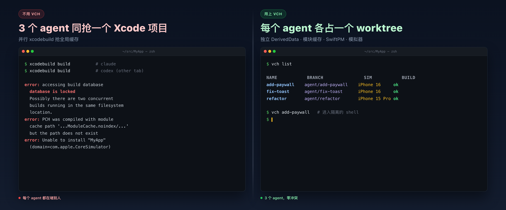
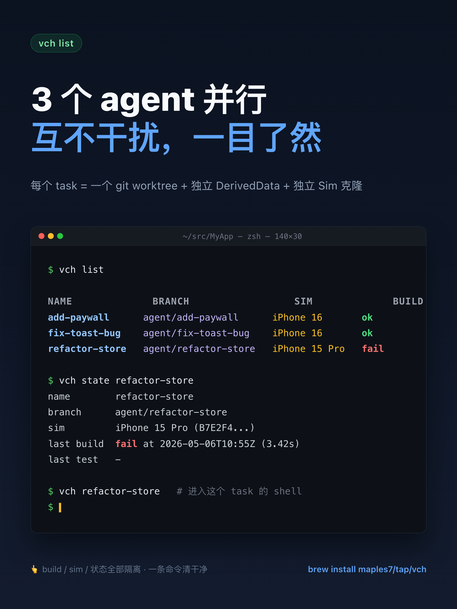
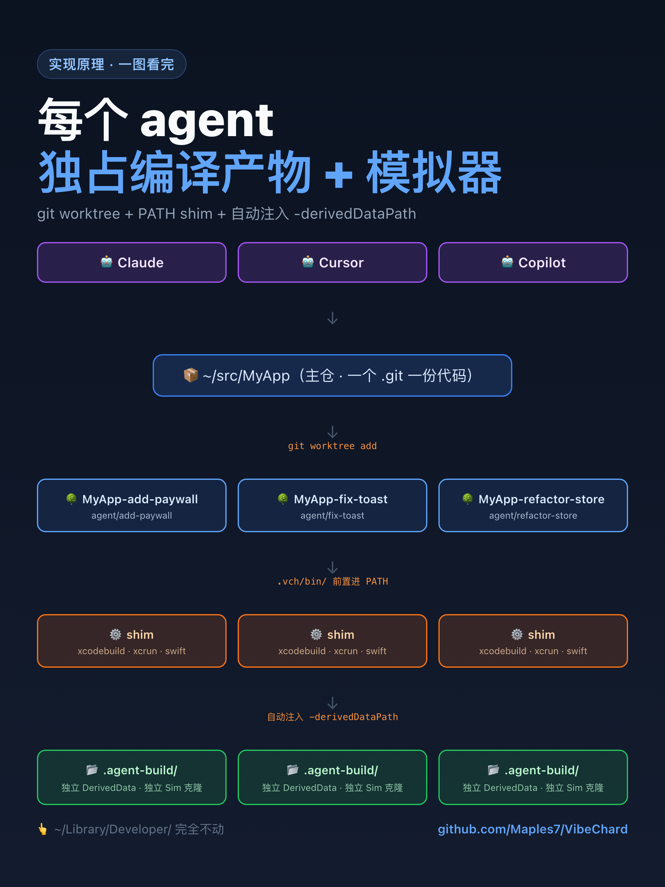

# VibeChard

[](https://github.com/Maples7/VibeChard/releases) [](https://github.com/Maples7/VibeChard/actions/workflows/ci.yml) [](LICENSE) [](https://swiftpackageindex.com/Maples7/VibeChard) [](https://swiftpackageindex.com/Maples7/VibeChard)

[English](README.md) · **简体中文** · [繁體中文](README.zh-TW.md) · [日本語](README.ja.md) · [한국어](README.ko.md)

<p align="center">
  <a href="docs/images/hero.zh-CN.png"></a>
</p>

> **为 AI 编程代理设计的 Apple 平台并行 worktree 隔离工具。**
> 在同一个 Xcode 项目里同时跑多个 Claude / Codex / Copilot / Cursor 会话，
> 不再触发 `build.db` 锁、`DerivedData` 抖动或者模拟器互相冲突。

```sh
brew install maples7/tap/vch
```

<p align="center">
  
</p>

随后在任意 Apple 项目里：

```sh
vch new add-paywall          # 创建隔离的 worktree + agent 分支
vch add-paywall              # 进入该 worktree 的 shell（隔离已生效）
                             # → 直接像平时一样用 xcodebuild / swift test
vch test add-paywall --device "iPhone 16"
vch remove add-paywall
```

就这些。每个 agent 拿到自己专属的 worktree、专属的 `DerivedData`、专属的模拟器克隆——你的 `~/Library/Developer/` 一字节都不会被动。

<p align="center">
  
</p>

> **状态：alpha。** CLI 接口已基本稳定但尚未冻结；
> `.vch/state.json` 的 schema 之后还可能加字段。需要稳定的话请固定 tag。

## 为什么单独做一个 CLI？

通用的 git-worktree 管理器（Rift、Emdash、Taskpods、Workie 之类）只解决「源码树隔离」一件事。但 Apple 的工具链里**至少还有 7 个**别的共享资源——并行跑 `xcodebuild` 时它们会互相踩，导致非确定性失败：

| 资源 | 不隔离时会怎样 | VibeChard 的做法 |
|---|---|---|
| `DerivedData` | 模块反复重建，缓存被污染 | `-derivedDataPath <wt>/.agent-build/DerivedData` |
| `ModuleCache.noindex` | 并发下 Clang 模块缓存损坏 | 每个 worktree 一个 `CLANG_MODULE_CACHE_PATH` |
| SwiftPM 全局缓存 | `Package.resolved` 写冲突 | 每个 worktree 一个 `-clonedSourcePackagesDirPath` |
| `xcresult` 报告包 | 后写者覆盖前写者 | 每个 worktree 一个 `-resultBundlePath` |
| 模拟器设备 | 两个任务同时往同一台 iPhone 16 装包 | 每个任务一个 `xcrun simctl clone` |
| Agent 走 PATH 找 `xcodebuild` | 直接绕过我们注入的 flag | **PATH shim** 自动注入 flag |
| 源码树 | 标准做法 | `git worktree` + `agent/<name>` 分支 |

工具是 **BYO Agent（自带代理）**——Claude、Codex、Copilot、Cursor，
任何能跑 shell 的东西都行。VibeChard *不是* AI 厂商的封装。无遥测、无网络请求、无 SDK 绑定。

<details>
<summary><strong>「直接用 <code>git worktree</code> + 写个 5 行的 shell 函数不就行了？」</strong></summary>

<br/>

合理的质疑——我一开始也是这么干的。代码树确实隔离了，但 agent 在
worktree 里跑的每一次 `xcodebuild` 仍然解析到这些**全局**位置：

- `~/Library/Developer/Xcode/DerivedData/MyApp-<hash>/`（全局默认）
- `~/Library/Developer/Xcode/DerivedData/ModuleCache.noindex/`（全局）
- `~/Library/Caches/org.swift.swiftpm/`（全局）
- `~/Library/Developer/CoreSimulator/Devices/<UDID>/`（全局）

只要其中任何一个被共享，并发下的 `xcodebuild` 就是 racy 的。要解决只有两条路：

1. **每次都手动传对 flag。** 每个 `xcodebuild`、每个 `swift test`
   都记得带上 `-derivedDataPath` / `-clonedSourcePackagesDirPath` /
   `-resultBundlePath`；然后还要教 Tuist、Fastlane、所有自定义测试脚本、任何会 shell out 的 `Package.swift` plugin 都这么做；然后还要叮嘱你的 *AI agent* 别忘——它一定会忘。
2. **在 `xcodebuild` 前面塞个 PATH shim**，保证不管谁、用什么方式调它，那些 flag 一定在。

VibeChard 选的是 (2)。这就是为什么它是个 CLI，而不是一段 `.zshrc`
片段。

</details>

## 安装

### Homebrew（推荐）

```sh
brew install maples7/tap/vch
```

formula 会安装：

- `vch` 到 Homebrew 的 `bin/`（在 `PATH` 上）
- `vch-xcodebuild-shim` 到 `libexec/`（**故意不**放在 `PATH` 上——它只应该被 `vch exec` 在每个任务的 `.vch/bin/` 里建的符号链接调到）
- Bash、Zsh、Fish 的命令补全脚本

### 从源码构建

环境要求：macOS 13+、Xcode 15.3+（Swift 5.10+）。

```sh
git clone https://github.com/maples7/VibeChard.git
cd VibeChard
swift build -c release
ln -s "$PWD/.build/release/vch" /usr/local/bin/vch    # 或者你存放 CLI 的任意位置
```

## 快速上手

在任意 git 仓库形态的 Apple 项目里：

```sh
# 1. 创建一个隔离的 worktree，分支为 agent/add-paywall
vch new add-paywall

# 2. 进到那个 worktree 的 shell（PATH shim 已激活）
vch add-paywall
# 在这个 shell 里：
#   xcodebuild build              ← 自动注入 -derivedDataPath
#   swift test                    ← 模块缓存 + SwiftPM 克隆目录已隔离
#   exit                          ← 回到原 shell

# 3. 也可以不进 shell，直接调 xcodebuild：
vch build add-paywall --scheme MyApp
vch test  add-paywall --scheme MyApp --device "iPhone 16"

# 4. 在 worktree 里直接驱动 agent：
vch new fix-toast --exec "claude"     # 在隔离的 worktree 里启动 claude
vch new triage --copy-untracked       # 顺便拷贝 .env / .vscode 等未跟踪文件
vch new --adopt-current               # 接管当前 linked worktree，并使用它的目录名
vch exec fix-toast -- npm run lint    # 在 worktree 里跑一次性命令

# 5. 查看与清理
vch list
vch path add-paywall                  # worktree 的绝对路径
vch remove add-paywall                # 删除 worktree + 分支 + 模拟器克隆
```

## 工作流：一连串任务

vch 的最佳使用姿势不是单个任务，而是**连续短任务**（或并行任务）：
每个任务都跑在自己的 worktree 里，落地完再起下一个。一个典型循环：

```sh
# 计划：A → B → C，每个任务都先合入再起下一个。

# 任务 A —— 实现、测试、Review。
vch new task-a
cd "$(vch path task-a)"
# ...编辑...
vch build task-a --scheme MyApp
vch test  task-a --scheme MyApp --device "iPhone 16"
git commit -am "perf: task A"
vch open task-a                       # 在 IDE 里 review

# 评审通过后，从主 worktree 合并：
cd /path/to/main-worktree
git merge --no-ff agent/task-a -m "Merge agent/task-a: <subject>"
vch remove task-a                     # worktree + 分支 + 模拟器克隆一起删干净

# 任务 B 从干净的 develop 重新开始，循环不变。
vch new task-b
# ...
```

每次 `vch new` 都会拿到独立的 SwiftPM 解析缓存、DerivedData 和模块
缓存（都在 `.vch/` 里），所以两个并行任务永远不会因为 SPM 锁竞争或
Xcode 构建缓存失效互相阻塞。从不同 shell 同时跑几个 `vch test` 也
不会撞 Core Data 数据库或抢同一个模拟器。

如果你要把 build/test 循环写进脚本，优先用 `vch build` /
`vch test`，而不是裸跑 `vch exec ... xcodebuild ...`；高层命令会
保留简洁摘要、日志和 result bundle 路径：

```sh
vch test task-a --scheme MyApp --device 'iPhone 16' \
  --only-testing MyAppTests/Foo
```

如果确实需要调用底层工具，优先使用稳定的
`vch state <name> --field <dotted>` 接口，不要直接读
`.vch/state.json`。

## Cookbook

不属于内置命令，但常常被问到的一些用法 —— 比如基于一个 WIP 中的任务再开
分支、只跑一部分测试、给长跑任务做基线同步、`vch land` 时保留生成的产物、
warm 模拟器模板的快速路径、重置每任务的模拟器状态、模板被 Booted 卡住时
的处理、清理已合并任务等等。

→ 完整内容见 **[docs/cookbook.md](docs/cookbook.md)**（英文单一来源，
详见 [AGENTS.md 规则 #10](AGENTS.md)）。

## 命令一览

| 命令 | 作用 |
|---|---|
| `vch new [<name>]` | 创建 worktree + `agent/<name>` 分支，或接管当前 linked worktree（配合 `--adopt-current` 时可省略 `<name>`；`--exec "<cmd>"`、`--copy-untracked`、`--seed-spm-from <task>`、`--cd`）。 |
| `vch list` | 列出工作区下所有任务（`--json`、`-v`、`--git-status`）。 |
| `vch state <name>` | 打印任务的 `.vch/state.json`（`--json`、`--field <dotted>`）。 |
| `vch path <name>` | 打印任务 worktree 的绝对路径。 |
| `vch open [<name>]` | 在 IDE 中打开 worktree（`--with xcode`/`code`/`cursor`/…）。 |
| `vch <name>` | 进入 worktree shell，隔离环境与 PATH shim 已就绪。 |
| `vch exec <name> -- <cmd...>` | 在任务 worktree 内跑任意命令，隔离已生效。 |
| `vch build <name>` | 跑 `xcodebuild build`，自动注入 `-derivedDataPath` / `-clonedSourcePackagesDirPath`（`--scheme`、`--runtime`、`--erase-clone`、`--shutdown-template`、`--verbose`）。 |
| `vch test <name>` | 跑 `xcodebuild test`，注入 `-resultBundlePath`，懒克隆模拟器（`--device`、`--runtime`、`--only-testing`、`--skip-testing`、`--rerun`、`--rerun-failed`、`--erase-clone`、`--shutdown-template`）。 |
| `vch run <name>` | 在任务的模拟器克隆上构建、安装并启动 App（`--erase-clone`、`--shutdown-template`、`-- launch-args`）。 |
| `vch logs <name>` | 打印任务最近一次构建/测试的完整 xcodebuild 日志（`--test`/`--build`）。 |
| `vch sim {clone,erase,shutdown,info} <name>` | 显式管理任务的模拟器克隆；通过重复执行 `vch sim clone --device <name>`，一个任务可以同时持有多个克隆（每个平台一个，例如 iOS + watchOS）（[#99](https://github.com/Maples7/VibeChard/issues/99)）。 |
| `vch sim warm-template {create,list,remove}` | 管理共享的 *warm* 模拟器模板（iOS / watchOS / tvOS / visionOS，[#47](https://github.com/Maples7/VibeChard/issues/47) / [#58](https://github.com/Maples7/VibeChard/issues/58)）。 |
| `vch land <name>` | 把 `agent/<name>` 合并回 base 并清理（`--into`、`--no-ff`/`--ff-only`/`--squash`、`--keep`、`--push`/`--push-to`、`--dry-run`）。 |
| `vch sync <name>` | 拉取 base 的 upstream 并把任务分支 rebase 上去（`--onto`、`--merge`、`--no-fetch`、`--dry-run`）。 |
| `vch remove <name>` | 删除 vch 创建的 worktree、分支和模拟器克隆；接管的任务只注销 vch 状态（`--allow-dirty`、`--force`、`--allow-unmerged`、`--keep-sim`）。 |
| `vch prune` | 列出或删除已完全合并进 base 的任务（`--rm`、`--allow-dirty`、`--force`、`--keep-sim`、`--json`）。 |
| `vch repair` | 用 `git worktree list` 的实际状态重新对齐 `.vch/state.json`。 |
| `vch clean <name>` | 删除任务的 DerivedData / ModuleCache（`--swiftpm`、`--logs`、`--all`、`--dry-run`）。 |
| `vch doctor` | 检测孤儿模拟器克隆、失效绑定、损坏的 `state.json`（`--clean`、`--bug-report`、`--json`）。 |
| `vch shellenv` | 输出 `vch_cd` / `vch_new` / `vch_clean` shell 助手函数（bash/zsh）。 |
| `vch completions install` | 安装 shell 补全脚本（`--shell`、`--print`、`--force`）。 |
| `vch version` | 打印版本与工具链信息（`--json` 为机器可读格式）。 |

所有接受 `<name>` 的命令都会从当前工作区拿任务名做补全——装好补全脚本按
 `<TAB>` 即可。完整 flag 参考见
**[docs/commands.md](docs/commands.md)**。

## 隔离的工作机制

<p align="center">
  
</p>

任务 worktree 内的 `<wt>/.vch/bin/` 会被前置到 `PATH` 上，里面有三个符号链接 `xcodebuild`、`xcrun`、`swift` 都指向 `vch-xcodebuild-shim`。

shim 读三个环境变量（`VCH_DERIVED_DATA_PATH`、`VCH_SPM_CLONE_DIR`、
`VCH_RESULT_BUNDLE_PATH`），如果用户没显式传对应 flag 就把它们注入到
`xcodebuild` 的 argv 里，`mkdir -p` 创建目标目录，然后通过
`/usr/bin/xcrun -f xcodebuild` 解出真实的 `xcodebuild` 路径并 `execv`
（绕开 `PATH`，避免递归调用自己）。对 `xcrun` 和 `swift` 是透明转发。

效果：任何 agent 可能跑的工具——`xcodebuild`、`swift test`、Tuist、内部又会调到 `xcodebuild` 的脚本——都自动被隔离。无需手动传 flag。

`vch build`、`vch test` 与 `vch run` 跳过 PATH shim，直接调用 `xcodebuild`
传相同的 flag——因为它们在调用点就知道所有参数。

### `vch exec` / `vch <name>` 给子进程注入了什么

`vch <name>`（= `vch exec <name> -- $SHELL`）和 `vch exec <name> --
<cmd>` 都会在你已有环境之上叠一层确定性的 env，跟 `vch build` / `vch
test` / `vch run` 用的是同一套——所以你在 `vch <name>` 里手敲
`xcodebuild` 的行为跟 `vch build` 完全一致。基本不需要再来个「把我
扔进任务环境」的命令，`vch <name>` 已经是了：

| 变量 | 设置为 |
|---|---|
| `VCH_TASK_NAME` | 任务名（如 `add-paywall`），常用于 PS1 / 终端标题。 |
| `VCH_TASK_ROOT` | worktree 绝对路径。 |
| `VCH_DERIVED_DATA_PATH` | `<wt>/.agent-build/DerivedData`（shim 读取）。 |
| `VCH_SPM_CLONE_DIR` | `<wt>/.agent-build/SourcePackages`（shim 读取）。 |
| `VCH_RESULT_BUNDLE_PATH` | `<wt>/.agent-build/Result.xcresult`（shim 读取）。 |
| `VCH_RESULT_BUNDLE_DIR` | result bundle 的父目录。 |
| `CLANG_MODULE_CACHE_PATH` | `<wt>/.agent-build/ModuleCache`（clang 读取）。 |
| `SWIFTPM_CACHE_DIR` | `<wt>/.agent-build/SourcePackages`（SwiftPM 读取）。 |
| `DEVELOPER_DIR` | 宿主选定的 Xcode（`xcode-select -p`）—— 仅当用户没设置时注入。 |
| `SIMCTL_CHILD_SIMULATOR_UDID` | 任务绑定的模拟器克隆 —— 仅当已绑定时设置。 |
| `PATH` | 在头部追加 `<wt>/.vch/bin`，让 `xcodebuild` / `xcrun` / `swift` 走 shim。 |

`vch` 不会覆盖你已经导出的值——在 `vch exec` 之前手动 `export` 任意一个，
你的值优先。

## 配置

无。所有任务级状态都在 `<worktree>/.vch/state.json` 里。没有 `~/.vchrc`、没有 `.vch.toml`、没有任何全局配置文件。唯一的运行时旋钮是上面提到的那几个 `VCH_*` 环境变量
（一般由 `vch exec` 自己设置，你很少需要手动配）。`vch build`/`vch test`/`vch run` 还会把宿主选定的 `DEVELOPER_DIR`（通过 `xcode-select -p` 解出）传给子进程——手动设置该环境变量即可覆盖。

如果 `vch new` 提示了 `eval "$(vch shellenv)"`，可以用 `VCH_NEW_HINT=0`
关闭这条提示（或者直接安装好 shell helper）。

## VibeChard 不是什么

- **不是 AI 厂商封装。** 没有 SDK、没有 API key、没有模型抽象。用任何 agent 都行——VibeChard 只负责让并行会话安全。
- **不跨平台。** 只服务 Apple，是设计选择。整个项目的价值就在
  Xcode 工具链上的深度，不在广度。
- **不是 CI 编排器。** 它跑在你本地终端、对你磁盘上的 worktree 起作用。
  CI 矩阵是另一类问题。

## 常见问题

<details>
<summary><strong>能跟 Tuist / Fastlane / xcbeautify 一起用吗？</strong></summary>

<br/>

可以。PATH shim 会拦截所有的 `xcodebuild` 调用，不管是谁发起的。Tuist
生成的执行、Fastlane 的 `gym` / `scan`、xcbeautify 上游的管道、任何最终调到 `xcodebuild` 上的自定义脚本——都会被自动注入每任务的
`-derivedDataPath` / `-clonedSourcePackagesDirPath` /
`-resultBundlePath`。你不用自己传 flag。

</details>

<details>
<summary><strong>CocoaPods / Carthage 呢？</strong></summary>

<br/>

可以。它们的依赖拉取步骤不走 `xcodebuild`，本来就不需要隔离；构建步骤最终会调到 `xcodebuild`，被 shim 拦下来。`Pods/` 和 `Carthage/` 目录跟源码一起待在 worktree 里，由 `git worktree` 本身隔离。

</details>

<details>
<summary><strong>纯 SwiftPM 项目（没有 <code>.xcodeproj</code>）？</strong></summary>

<br/>

行。`swift build` / `swift test` 默认就把产物写进每个 worktree 自己的
`.build/`——天然隔离，shim 不用注入 flag。shim 仍然会包住 `swift` 但只做透明 passthrough。

</details>

<details>
<summary><strong><code>vch remove</code> 时未提交的改动会丢吗？</strong></summary>

<br/>

不会——它会拒绝执行。`vch remove` 在 worktree 脏的时候会带着明确提示中止。加 `--allow-dirty` 才会强删（连带丢掉未提交改动）；加 `--allow-unmerged`（或两个标志同时使用）还允许删除有未合并提交的分支。没有静默的破坏路径。

</details>

<details>
<summary><strong>不用 AI agent 也能用吗？</strong></summary>

<br/>

能。任何「我想要个并行沙盒」的场景都行：同时试两套互不相同的实现、跑长测试套件的同时在主 worktree 继续写代码，等等。CLI 跟 agent 解耦——所谓 agent 集成只是 `--exec "<your command>"`。

</details>

## 从源码构建与测试

```sh
swift build -c release
./.build/release/vch version
swift test --parallel
```

CI 在每次 push 上跑相同的命令，外加一个 shim 的烟雾测试：
[.github/workflows/ci.yml](.github/workflows/ci.yml)。

## 许可证

[Apache-2.0](LICENSE)。无 CLA，无遥测，无网络请求。
