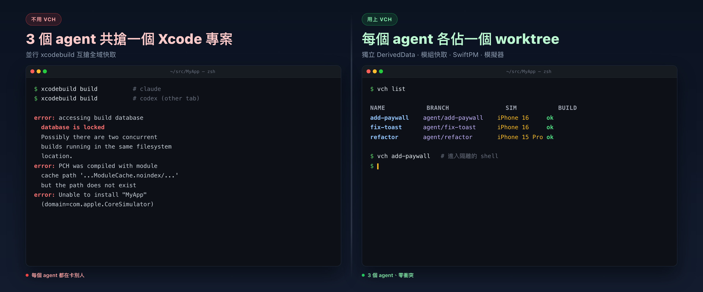
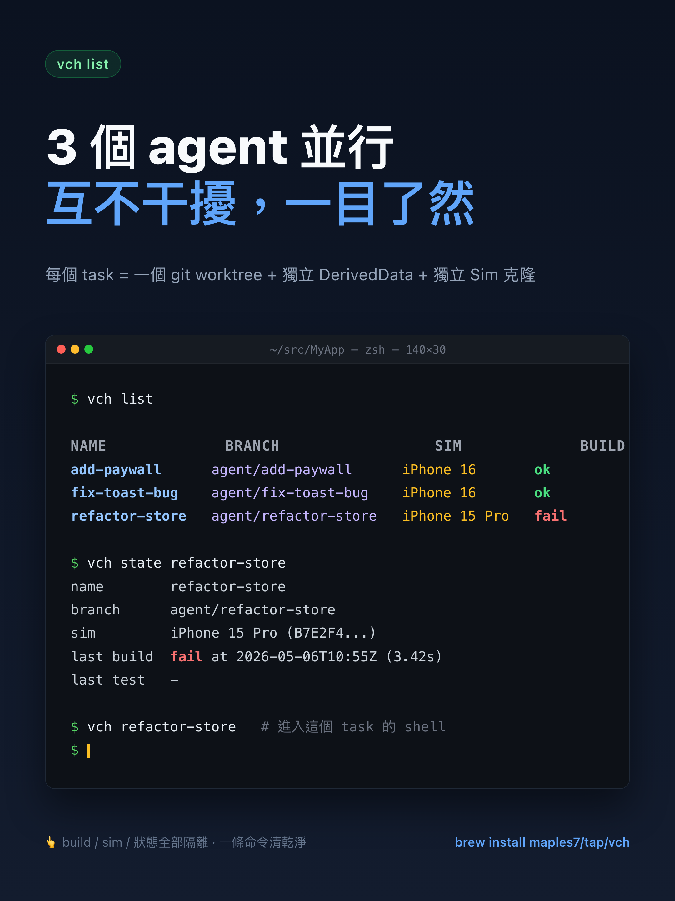
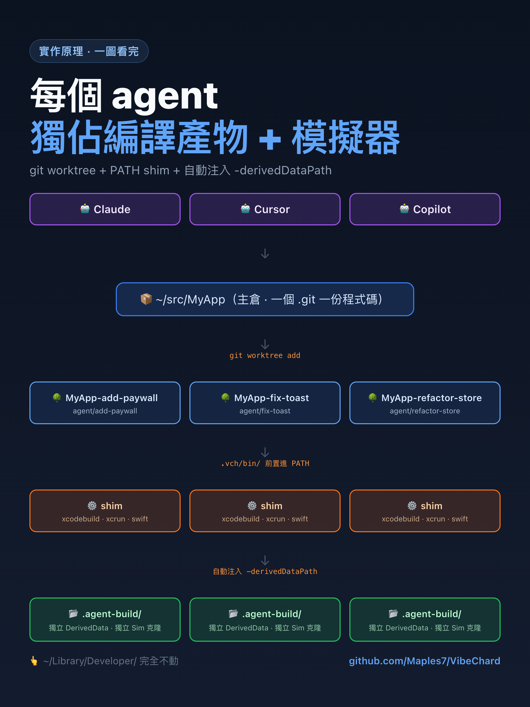

# VibeChard

[](https://github.com/Maples7/VibeChard/releases) [](https://github.com/Maples7/VibeChard/actions/workflows/ci.yml) [](LICENSE)  

[English](README.md) · [简体中文](README.zh-CN.md) · **繁體中文** · [日本語](README.ja.md) · [한국어](README.ko.md)

<p align="center">
  <a href="docs/images/hero.zh-TW.png"></a>
</p>

> **為 AI 編程代理設計的 Apple 平台並行 worktree 隔離工具。**
> 在同一個 Xcode 專案裡同時跑多個 Claude / Codex / Copilot / Cursor 工作階段，
> 不再觸發 `build.db` 鎖、`DerivedData` 抖動或者模擬器互相衝突。

```sh
brew install maples7/tap/vch
```

<p align="center">
  
</p>

接著在任何 Apple 專案裡：

```sh
vch new add-paywall          # 建立隔離的 worktree + agent 分支
vch add-paywall              # 進入該 worktree 的 shell（隔離已生效）
                             # → 直接像平常一樣用 xcodebuild / swift test
vch test add-paywall --device "iPhone 16"
vch remove add-paywall
```

就這樣。每個 agent 都拿到自己專屬的 worktree、專屬的 `DerivedData`、專屬的模擬器副本——你的 `~/Library/Developer/` 一個位元組都不會被動。

<p align="center">
  
</p>

> **狀態：alpha (v0.1.0)。** CLI 介面已大致穩定但尚未凍結；
> `.vch/state.json` 的 schema 之後還可能新增欄位。需要穩定請固定 tag。

## 為什麼要單獨做一個 CLI？

通用的 git-worktree 管理器（Rift、Emdash、Taskpods、Workie 之類）只解決「原始碼樹隔離」一件事。但 Apple 的工具鏈裡**至少還有 7 個**別的共享資源——並行跑 `xcodebuild` 時它們會互相干擾，導致非確定性失敗：

| 資源 | 不隔離時會怎樣 | VibeChard 的做法 |
|---|---|---|
| `DerivedData` | 模組反覆重建、快取被汙染 | `-derivedDataPath <wt>/.agent-build/DerivedData` |
| `ModuleCache.noindex` | 並行下 Clang 模組快取損毀 | 每個 worktree 一個 `CLANG_MODULE_CACHE_PATH` |
| SwiftPM 全域快取 | `Package.resolved` 寫入衝突 | 每個 worktree 一個 `-clonedSourcePackagesDirPath` |
| `xcresult` 報告包 | 後寫者覆蓋前寫者 | 每個 worktree 一個 `-resultBundlePath` |
| 模擬器裝置 | 兩個任務同時往同一台 iPhone 16 安裝 | 每個任務一個 `xcrun simctl clone` |
| Agent 走 PATH 找 `xcodebuild` | 直接繞過我們注入的 flag | **PATH shim** 自動注入 flag |
| 原始碼樹 | 標準做法 | `git worktree` + `agent/<name>` 分支 |

工具是 **BYO Agent（自帶代理）**——Claude、Codex、Copilot、Cursor，
任何能跑 shell 的東西都行。VibeChard *不是* AI 廠商的封裝。沒有遙測、沒有網路請求、沒有 SDK 綁定。
<details>
<summary><strong>「直接用 <code>git worktree</code> + 寫個 5 行 shell function 不就好了？」</strong></summary>

<br/>

合理的懷疑——我一開始也是這麼做的。原始碼樹確實被隔離了，但 agent
在 worktree 裡跑的每一次 `xcodebuild` 仍然解析到這些**全域**位置：

- `~/Library/Developer/Xcode/DerivedData/MyApp-<hash>/`（全域預設）
- `~/Library/Developer/Xcode/DerivedData/ModuleCache.noindex/`（全域）
- `~/Library/Caches/org.swift.swiftpm/`（全域）
- `~/Library/Developer/CoreSimulator/Devices/<UDID>/`（全域）

只要任何一個被共用，並發下的 `xcodebuild` 就是 racy。能解決的方式只有兩條：

1. **每次都手動傳對 flag。** 每個 `xcodebuild`、每個 `swift test`
   都記得加上 `-derivedDataPath` / `-clonedSourcePackagesDirPath` /
   `-resultBundlePath`；然後還要教 Tuist、Fastlane、所有自訂測試腳本、任何會 shell out 的 `Package.swift` plugin 都這麼做；然後還要叮寧你的 *AI agent* 別忘——它一定會忘。
2. **在 `xcodebuild` 前面塞一個 PATH shim**，保證不管誰、用什麼方式叫它，那些 flag 一定都在。

VibeChard 選的是 (2)。這就是為什麼它是 CLI，而不是一段 `.zshrc`
片段。

</details>
## 安裝

### Homebrew（推薦）

```sh
brew install maples7/tap/vch
```

formula 會安裝：

- `vch` 到 Homebrew 的 `bin/`（在 `PATH` 上）
- `vch-xcodebuild-shim` 到 `libexec/`（**故意不**放在 `PATH` 上——它只應該被 `vch exec` 在每個任務的 `.vch/bin/` 裡建立的符號連結呼叫到）
- Bash、Zsh、Fish 的命令補全指令稿

### 從原始碼建置

環境需求：macOS 13+、Xcode 15.3+（Swift 5.10+）。

```sh
git clone https://github.com/maples7/VibeChard.git
cd VibeChard
swift build -c release
ln -s "$PWD/.build/release/vch" /usr/local/bin/vch    # 或者你存放 CLI 的任意位置
```

## 快速上手

在任何 git 控管下的 Apple 專案內：

```sh
# 1. 建立隔離的 worktree，分支為 agent/add-paywall
vch new add-paywall

# 2. 進到那個 worktree 的 shell（PATH shim 已啟用）
vch add-paywall
# 在這個 shell 裡：
#   xcodebuild build              ← 自動注入 -derivedDataPath
#   swift test                    ← 模組快取 + SwiftPM 複製目錄已隔離
#   exit                          ← 回到原本的 shell

# 3. 也可以不進 shell，直接呼叫 xcodebuild：
vch build add-paywall --scheme MyApp
vch test  add-paywall --scheme MyApp --device "iPhone 16"

# 4. 在 worktree 裡直接驅動 agent：
vch new fix-toast --exec "claude"     # 在隔離的 worktree 裡啟動 claude
vch new triage --copy-untracked       # 順便將 .env / .vscode 等未追蹤檔案一起帶過來
vch exec fix-toast -- npm run lint    # 在 worktree 裡跑一次性指令

# 5. 檢視與清理
vch list
vch path add-paywall                  # worktree 的絕對路徑
vch remove add-paywall                # 刪除 worktree + 分支 + 模擬器副本
```

## 工作流：一連串任務

vch 的最佳使用姿態不是單一任務，而是**連續短任務**（或平行任務）：
每個任務都跑在自己的 worktree 裡，落地完再起下一個。一個典型循環：

```sh
# 規劃：A → B → C，每個任務都先合入再起下一個。

# 任務 A —— 實作、測試、Review。
vch new task-a
cd "$(vch path task-a)"
# ...編輯...
vch build task-a --scheme MyApp
vch test  task-a --scheme MyApp --device "iPhone 16"
git commit -am "perf: task A"
vch open task-a                       # 在 IDE 裡 review

# 評審通過後，從主 worktree 合併：
cd /path/to/main-worktree
git merge --no-ff agent/task-a -m "Merge agent/task-a: <subject>"
vch remove task-a                     # worktree + 分支 + 模擬器副本一起刪乾淨

# 任務 B 從乾淨的 develop 重新開始，循環不變。
vch new task-b
# ...
```

每次 `vch new` 都拿到獨立的 SwiftPM 解析快取、DerivedData 與模組
快取（都在 `.vch/` 裡），所以兩個平行任務永遠不會因 SPM 鎖競爭或
Xcode 建置快取失效互相阻塞。從不同 shell 同時跑幾個 `vch test` 也
不會撞 Core Data 資料庫或抶同一個模擬器。

如果你為 vch 寫腳本（例如驅動 agent），請優先使用穩定的
`vch state <name> --field <dotted>` 介面，不要直接讀
`.vch/state.json`：

```sh
udid=$(vch state task-a --field simulator.udid)
vch exec task-a -- xcodebuild test \
  -scheme MyApp \
  -destination "platform=iOS Simulator,id=$udid" \
  -only-testing:MyAppTests/Foo
```

## 指令一覽

| 指令 | 作用 |
|---|---|
| `vch new <name>` | 在 `../<repo>-<name>` 建立 worktree，分支為 `agent/<name>`。`--exec "<cmd>"` 在 worktree 內直接執行指令（例如 AI agent）。`--copy-untracked` 會連同未追蹤、未被忽略的檔案（如 `.env`、`.vscode/settings.json`）一起複製過來。 |
| `vch list` | 列出目前工作區下所有任務。`--json` 為機器可讀格式；`-v`/`--verbose` 增加 `BASE` 與 `PATH` 欄位。 |
| `vch state <name>` | 漂亮印出任務的 `.vch/state.json`。`--json` 輸出原始檔案內容。`--field <dotted>` 只輸出單個欄位值（如 `simulator.udid`），方便在腳本裡 `$(vch state foo --field simulator.udid)` 這樣取。 |
| `vch path <name>` | 印出任務 worktree 的絕對路徑。 |
| `vch open [<name>] [--with <ide>]` | 在 IDE 中開啟 worktree。自動偵測 `*.xcworkspace` / `*.xcodeproj` / `Package.swift`（專案檔走 Xcode，其他走 VS Code）。`--with` 支援 `xcode`、`code`/`vscode`、`cursor`，或任意 app 名稱（透傳給 `open -a`）。可用 `VCH_OPEN_DEFAULT` 覆寫預設值。未指定 `<name>` 時使用 `$PWD` 所在的 worktree。 |
| `vch <name>` | `vch exec <name> -- $SHELL` 的語法糖——開一個 shell，隔離環境變數 + `.vch/bin` PATH shim 已就緒。 |
| `vch exec <name> -- <cmd...>` | 在任務 worktree 內執行任意指令，隔離已生效。 |
| `vch build <name> [flags] [-- xcodebuild-extras]` | 對任務的 worktree 執行 `xcodebuild build`，自動注入 `-derivedDataPath` / `-clonedSourcePackagesDirPath`。當專案只有一個共用 scheme 時，`--scheme` 可省（透過 `xcodebuild -list -json` 自動識別）；記錄後會在後續呼叫裡重複使用。`--runtime 'iOS 26.4'` 用來在多個同名裝置模板（不同 iOS runtime）並存時鎖定要用的 runtime。 |
| `vch test  <name> [flags] [-- xcodebuild-extras]` | 執行 `xcodebuild test`，注入 `-resultBundlePath`；首次 `--device` 時延遲複製模擬器，後續重複使用。`--scheme` 自動識別與 `--runtime` 行為同 `vch build`。預設只輸出精簡摘要（每個 suite 一行，失敗測試會展開檔案:行號與斷言訊息）；`--verbose` 會把 xcodebuild 完整輸出直通到終端。完整 firehose 一律 tee 到 `<wt>/.vch/last-test.log`。 |
| `vch run   <name> [flags] [-- launch-args]` | 在任務的模擬器複本上建置、安裝並啟動 App。`--scheme` 自動識別與 `--runtime` 行為同 `vch build`，`PRODUCT_BUNDLE_IDENTIFIER` 透過 `xcodebuild -showBuildSettings -json` 自動解析。`--` 之後的參數原樣轉發給 `simctl launch`，例如 `vch run alpha -- -UsePreviewSampleData`。如有需要會自動啟動模擬器並打開 `Simulator.app`。 |
| `vch logs <name> [--test]` | 印出任務最近一次 `vch test` 的完整 xcodebuild log。當精簡摘要指向某個失敗時，可用它檢視前後脈絡。目前只支援 `--test`；log 每次測試會覆寫。 |
| `vch sim {clone,erase,shutdown,info} <name>` | 顯式管理任務的模擬器副本。 |
| `vch land <name> [--into <branch>] [--no-ff\|--ff-only\|--squash] [--message MSG] [--keep] [--allow-dirty] [--dry-run]` | 將 `agent/<name>` 合併回基準分支（在 `vch new` 時記錄於 `state.json` 的主 worktree 分支）並刪除 worktree。預設 `--no-ff`；預設提交訊息 `Merge agent/<name>: <最近一個非合併提交的標題>`。下列狀況下拒絕合併：空合併、主 worktree 不在目標分支上、主 worktree 中與任務分支 diff 重疊的路徑未提交（可用 `--allow-dirty` 跳過）。`--keep` 跳過自動 rm；`--dry-run` 只列出計畫不動任何東西。 |
| `vch remove <name> [--force [--force]] [--keep-sim]` | 刪除 worktree、分支以及（預設會刪的）模擬器副本。兩次 `--force` 才允許髒樹 + 未合併分支。 |
| `vch repair` | 用 `git worktree list` 的實際狀態重新對齊 `.vch/state.json`。 |
| `vch doctor [--clean] [--json]` | 偵測孤兒模擬器副本、失效綁定、毀損的 `state.json`。有發現就以非零退出。 |
| `vch shellenv` | 輸出 `vch_cd` / `vch_new` / `vch_clean` shell 輔助函式（bash/zsh）。 |
| `vch completions install [--shell <s>]` | 安裝 `zsh` / `bash` / `fish` 的補全腳本（預設從 `$SHELL` 自動識別）。`--print` 預覽；`--force` 覆寫已有檔案。 |
| `vch version` | 印出版本與工具鏈資訊（`--json` 為機器可讀格式）。 |

所有接受 `<name>` 的指令都會從目前工作區的任務名做補全——裝好補全指令稿，按 `<TAB>` 即可。

## 隔離的運作方式

<p align="center">
  
</p>

任務 worktree 內的 `<wt>/.vch/bin/` 會被前置到 `PATH` 上，裡面有三個符號連結 `xcodebuild`、`xcrun`、`swift` 都指向 `vch-xcodebuild-shim`。

shim 讀取三個環境變數（`VCH_DERIVED_DATA_PATH`、`VCH_SPM_CLONE_DIR`、
`VCH_RESULT_BUNDLE_PATH`），如果使用者沒明確傳對應 flag 就將它們注入到
`xcodebuild` 的 argv 裡，`mkdir -p` 建立目標目錄，然後透過
`/usr/bin/xcrun -f xcodebuild` 解析出真正的 `xcodebuild` 路徑並 `execv`
（繞過 `PATH`，避免遞迴呼叫自己）。對 `xcrun` 與 `swift` 則是透明轉發。

效果：任何 agent 可能執行的工具——`xcodebuild`、`swift test`、Tuist、內部又會呼叫 `xcodebuild` 的指令稿——都會自動被隔離。無需手動傳 flag。

`vch build`、`vch test` 與 `vch run` 跳過 PATH shim，直接呼叫 `xcodebuild`
傳遞相同的 flag——因為它們在呼叫點就知道所有參數。

## 設定

無。所有任務級狀態都在 `<worktree>/.vch/state.json` 裡。沒有 `~/.vchrc`、沒有 `.vch.toml`、沒有任何全域設定檔。唯一的執行期旋鈕是上面提到的那幾個 `VCH_*` 環境變數
（一般由 `vch exec` 自己設定，你很少需要手動配置）。

## VibeChard 不是什麼

- **不是 AI 廠商封裝。** 沒有 SDK、沒有 API key、沒有模型抽象。用任何 agent 都行——VibeChard 只負責讓並行工作階段安全。
- **不跨平台。** 只服務 Apple，是設計選擇。整個專案的價值就在
  Xcode 工具鏈上的深度，不在廣度。
- **不是 CI 編排器。** 它跑在你本地終端機、對你磁碟上的 worktree 起作用。
  CI 矩陣是另一類問題。

## 常見問題

<details>
<summary><strong>能跟 Tuist / Fastlane / xcbeautify 一起用嗎？</strong></summary>

<br/>

可以。PATH shim 會拦截所有的 `xcodebuild` 呼叫，不管是誰發起的。Tuist
產生的執行、Fastlane 的 `gym` / `scan`、xcbeautify 上游的管道、任何最終貓到 `xcodebuild` 上的自訂腳本——都會被自動注入每任務的
`-derivedDataPath` / `-clonedSourcePackagesDirPath` /
`-resultBundlePath`。你不用自己傳 flag。

</details>

<details>
<summary><strong>CocoaPods / Carthage 呢？</strong></summary>

<br/>

可以。它們的相依拉取步驟不走 `xcodebuild`，本來就不需要隔離；建構步驟最終會貓到 `xcodebuild`，被 shim 攝下來。`Pods/` 和 `Carthage/` 目錄跟原始碼一起待在 worktree 裡，由 `git worktree` 本身隔離。

</details>

<details>
<summary><strong>純 SwiftPM 專案（沒有 <code>.xcodeproj</code>）？</strong></summary>

<br/>

行。`swift build` / `swift test` 預設就把產物寫進每個 worktree 自己的
`.build/`——天然隔離，shim 不用注入 flag。shim 仍然會包住 `swift` 但只做透明 passthrough。

</details>

<details>
<summary><strong><code>vch remove</code> 時未提交的改動會丟嗎？</strong></summary>

<br/>

不會——它會拒絕執行。`vch remove` 在 worktree 骧的時候會帶著明確提示中止。加一次 `--force` 才會強刪（連帶丟掉未提交改動）；加兩次 `--force`
還允許刪除有未合併提交的分支。沒有靜默的破壞路徑。

</details>

<details>
<summary><strong>不用 AI agent 也能用嗎？</strong></summary>

<br/>

能。任何「我想要個並行沙盒」的場景都行：同時試兩套互不相同的實作、跑長測試套件的同時在主 worktree 繼續寫程式，等等。CLI 跟 agent 解耦——所謂 agent 整合只是 `--exec "<your command>"`。

</details>

## 從原始碼建置與測試

```sh
swift build -c release
./.build/release/vch version
swift test --parallel             # 116 個測試，M 系列晶片上約 9 秒
```

CI 在每次 push 時跑相同的指令，外加一個 shim 的煙霧測試：
[.github/workflows/ci.yml](.github/workflows/ci.yml)。

## 授權

[Apache-2.0](LICENSE)。無 CLA，無遙測，無網路請求。
